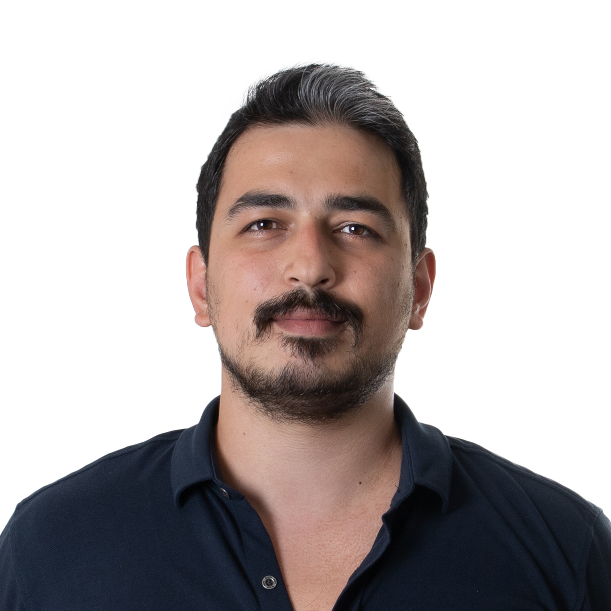
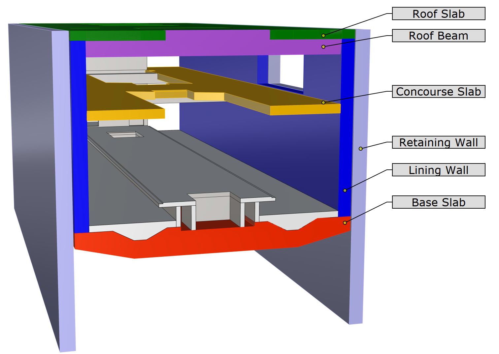
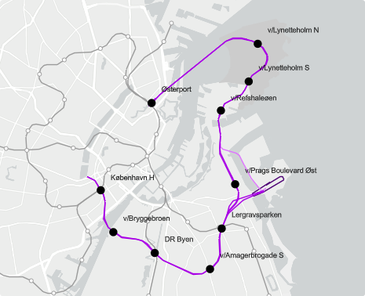
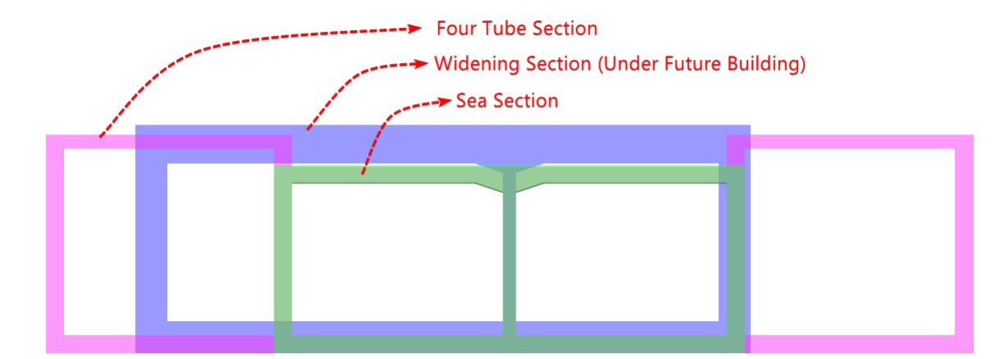
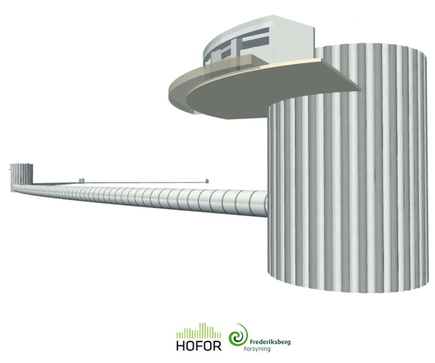
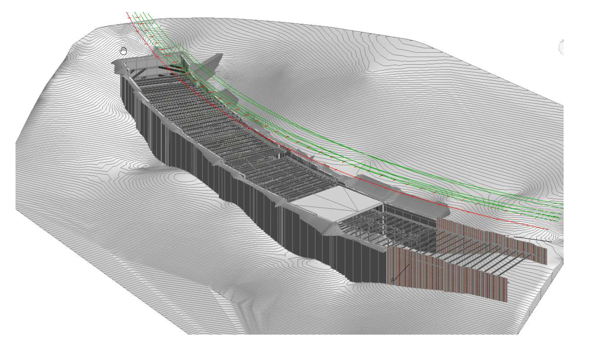
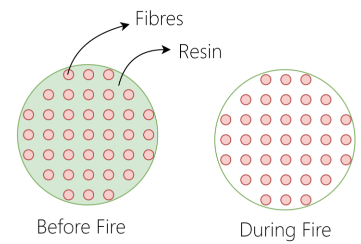
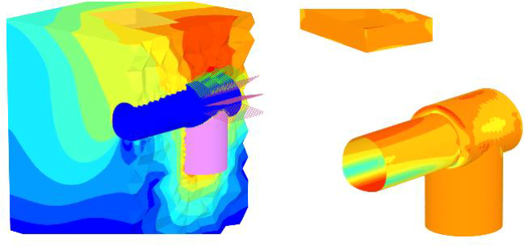
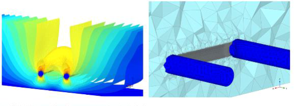
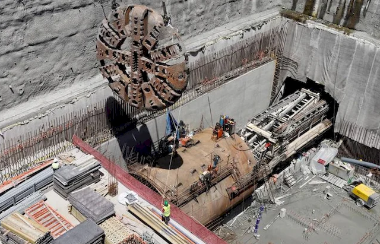

**Berk Demir**
*Underground engineer specialized in tunnels, structural design and geotechnical engineering.*

**M:** +45 60 25 49 01
**E:** bdberkdemir@gmail.com
**A:** Copenhagen, Denmark
**LinkedIn:** [bdberkdemir](https://www.linkedin.com/in/bdberkdemir/)

---

## Brief Summary

I started my career as a **geotechnical engineer** and worked on many aspects of geotechnics such as deep excavations, deep foundations, liquefaction remediation and so on. Later, I continued my work on the Istanbul metro as **lead tunnel designer** for both TBM and NATM tunnels. After moving to Denmark, I continued to work on various underground projects with an increasing focus on **structural design**.

---

## Professional Experience

| Period | Role | Company | Location |
|---|---|---|---|
| 2023 – Present | Senior Tunnel Engineer | COWI | Copenhagen, Denmark |
| 2021 – 2023 | Senior Tunnel Engineer | Niras A/S | Copenhagen, Denmark |
| 2018 – 2021 | Senior Geotechnical and Tunnel Engineer | Tekfen Engineering | Istanbul, Turkey |
| 2017 – 2018 | Geotechnical Design Engineer | Destech Consultancy | Izmir & Tanzania |
| 2015 – 2017 | Geotechnical Design Engineer | Kilci Engineering | Ankara, Turkey |
| 2014 – 2015 | Technical Office Engineer | Sonar Drilling | Ankara, Turkey |

---

## Academic Background

| Degree | University | Field | Years |
|---|---|---|---|
| MSc | Middle East Technical University, Turkey | Geotechnical Engineering | 2014–2019 |
| BSc | Middle East Technical University, Turkey | Civil Engineering | 2009–2014 |

---

## Technical Publications

- Recommendations for Pseudo-Static Deformation for Seismic Analyses of Tunnels, Berk Demir & Pinar Akdogan Demir, 2022
- **Master Thesis:** Performance of Short Anchors Inside the Failure Wedge (2019)
- Comparison of Simplified Piled Raft Calculation Methods with Plaxis 3D and Details of Hardening Soil Model (2019) — [ResearchGate](https://www.researchgate.net/publication/332188093_Basitlestirilmis_Kazikli_Temel_Hesaplama_Yontemlerinin_Plaxis_3D_ile_Karsilastirilmasi_Hardening_Soil_Modelinin_Detaylarinin_Incelenmesi)
- P-Y Curves and Turkish Building Earthquake Code Requirements (2 papers), 4th Bridges and Viaducts Symposium, 2019 — [Part 1](https://www.researchgate.net/publication/337941366_P-Y_Egrileri_Ve_TBDY_2018_Gereklilikleri_P-Y_Egrilerinin_Degerlendirilmesi_Bolum_1) / [Part 2](https://www.researchgate.net/publication/337941206_P-Y_Egrileri_Ve_TBDY_2018_Gereklilikleri_P-Y_Egrilerinin_Olusturulmasi_Bolum_2)
- Comparison of Construction Methods of Jet Grout Columns, 16th National Conference on Soil Mechanics and Geotechnical Engineering, Erzurum, 2016

---

## Skills

### Software

| Software | Level |
|---|---|
| Plaxis 2D & 3D | High |
| Python | High |
| Lusas | High |
| Strusoft FemDesign | High |
| Rocscience (Settle, Slide, RS2) | High |
| Ensoft (LPile, Group, Shaft) | High |
| Geologismiki | High |
| Optum G2 | High |
| Autodesk Robot | Intermediate |
| Grasshopper | Intermediate |

**Python tools built in Streamlit** for daily design work: RC Beam Design · Tunnel Analytical Lining Forces · Tunnel Deformation Assessment · M-N Interaction Curve · Hoek Brown Analysis · Convergence Confinement Method · Drawdown due to Tunnel · Steel Strut Capacity · Tunnel Relaxation Factor · Tunnel Face Stability · 3D Settlement Analysis · Longitudinal Pipe Capacity · Steel Fibre Crack Width · Volume Loss Fit for Measurements

**Languages:** Turkish (native) · English (fluent) · Danish (intermediate)

---

## Key Projects

### Copenhagen M5 Metro (2023–2025)
**JV:** COWI & Arup &nbsp;|&nbsp; **Client:** Metroselskabet A/S &nbsp;|&nbsp; **Hours:** >2500

Reference design for the M5 Metro tender — the next metro line in Copenhagen.

- Innovation study: removal of lining wall in stations, use of retaining walls as main lining
- Innovation study: geopolymer concrete for M5 Metro
- Innovation study: minimum reinforcement methodology
- Station lead: coordination of all disciplines for two underground stations
- Structural design lead: Sofistik for main station, FemDesign for smaller structures

---

### Nordhavnstunnel (2022–2023)
**JV:** MT Højgaard & Besix &nbsp;|&nbsp; **Client:** Vejdirektoratet &nbsp;|&nbsp; **Hours:** >800

1.6 km cut-and-cover, cast-in-situ tunnel in Copenhagen.

- All tender design: Lusas models, reinforcement calculations, uplift anchor calculations, settlement calculations
- Design lead post-tender: structural and fire design, 3rd party coordination, QA of design reports

---

### Valby Cloudburst Tunnel (2021–2023)
**Client:** HOFOR &nbsp;|&nbsp; **Hours:** >1300

Detailed design of 4 shafts (~15 m diameter, ~20 m depth) and DN3400/OD4000 pipe jacking.

- TBM-related studies, pipe and alignment studies
- Settlement analyses due to tunnelling and excavations
- Technical coordination of structural and geotechnical shaft design

---

### Kransen Culvert Deep Excavation (2021–2022)
**JV:** Acciona & Implenia &nbsp;|&nbsp; **Client:** Bane Nor, Norway &nbsp;|&nbsp; **Hours:** 800

Diaphragm wall excavation with prestressed struts in quick clay slope (SMS2A project).

- Design lead for all temporary works
- Finite element analyses including detailed temperature studies

---

### GFRP Reinforcement in TBM Tunnel Segments (2023)
**Client:** Metroselskabet &nbsp;|&nbsp; **Hours:** 200

Feasibility study for GFRP reinforcement in TBM segments — CO2 comparisons, fire behaviour, durability, load scenarios using Lusas.

---

### Istanbul Metro / Çekmeköy–Sultanbeyli Line (2019–2021)
**JV:** Doğuş & Yapı Merkezi & Özaltın &nbsp;|&nbsp; **Client:** Istanbul Municipality &nbsp;|&nbsp; **Hours:** >2500

Detailed design of TBM and NATM tunnels for construction issue.

- EPB TBM (6.57 m diameter): segment design, EPB pressure estimates, thrust frame and launching/receiving schemes
- NATM: temporary and permanent lining design including very soft soil conditions

---

## Other Projects

- **Klimatilpasning af det centrale Lyngby** (2021–2022) — 9 pipe jacking drives (DN1200) and 12 shafts in Lyngby
- **Çanakkale 1915 Bridge** (2018–2019) — Peer review: anchor block foundations, deep foundations in liquefiable areas
- **Bodrum Highway Tunnels** (2018–2019) — 2-lane NATM highway tunnels in mountainous terrain
- **Dar es Salaam–Morogoro Railway** (2018) — Geotechnical design, 205 km design-and-build, Tanzania
- **Cargo Building Foundation, Istanbul New Airport** (2018) — Turkish Airlines
- **Grand Canyon Sofia** (2017) — Remediation of problematic diaphragm wall panels
- **Çanakkale Children's Science Museum** (2017) — Liquefaction remediation near Aegean Sea
- **Polatlı–Afyon High Speed Train** (2015–2017) — 88 km stretch, 57 embankments, stone columns, 40+ structures
- **Ataköy Sea Pearl** (2015–2017) — Retaining systems near Marmara Sea
- **Ulus Cultural and Convention Center** (2016–2017) — Deep excavation up to 22 m in variable ground
- **Mavişehir Optimum Mall** (2016) — Deep excavation with diaphragm wall, anchors and jet grout foundations
