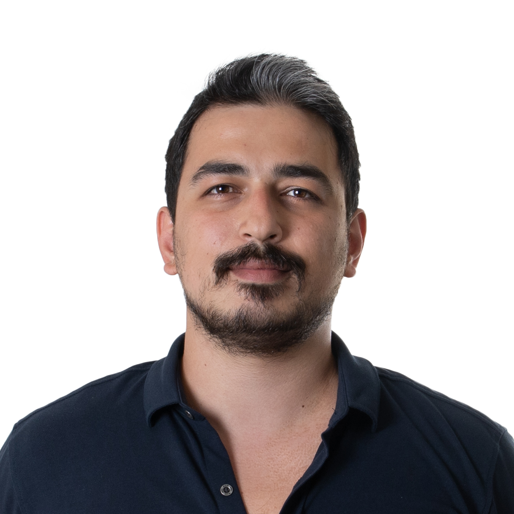
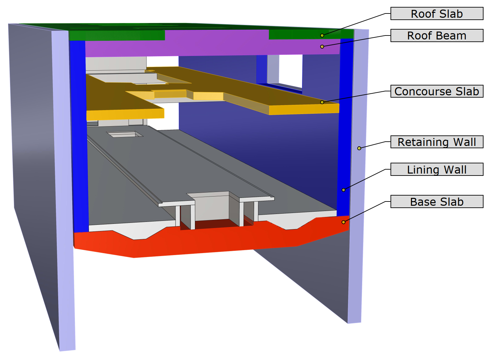
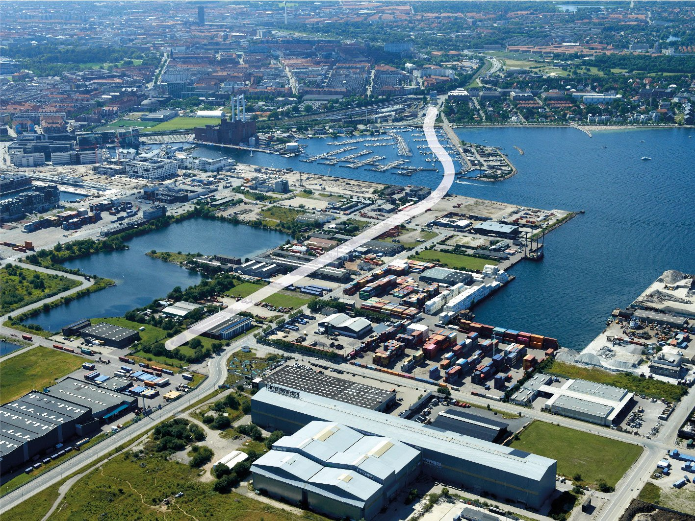
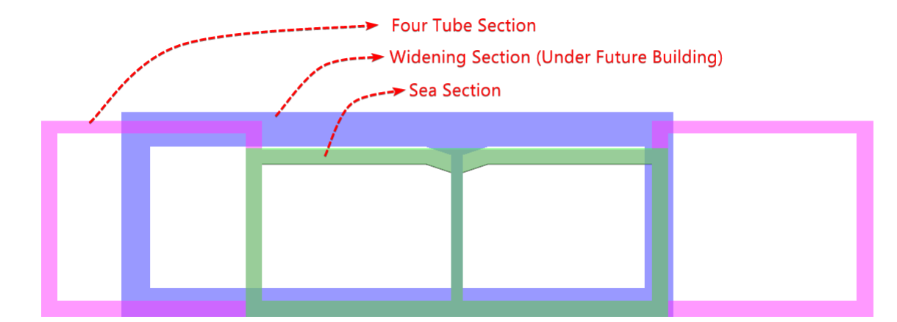
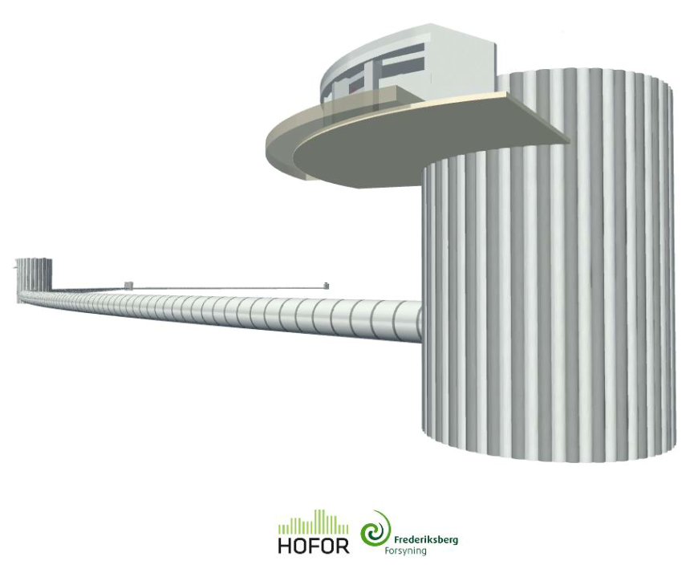
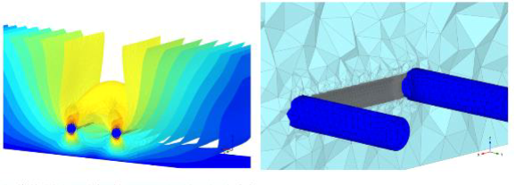
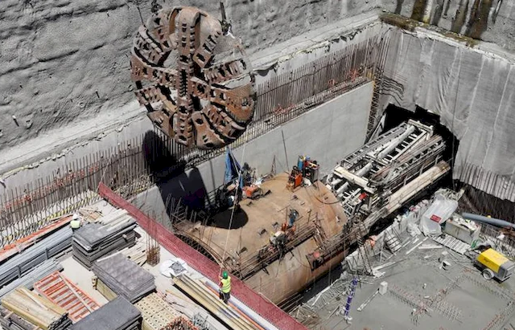

Berk Demir

Underground engineer specialized in tunnels, structural design and geotechnical engineering.

<strong>M:</strong> +45 60 25 49 01 
<strong>E:</strong> bdberkdemir@gmail.com 
<strong>W:</strong> <a href="https://berkdemir.github.io/">berkdemir.github.io</a> / <a href="https://www.linkedin.com/in/bdberkdemir/">LinkedIn</a> 
<strong>A:</strong> Copenhagen, Denmark

---

## Brief Summary

I started my career as a **geotechnical engineer** and worked on many aspects of geotechnics such as deep excavations, deep foundations, liquefaction remediation and so on. Later, I continued my work on the Istanbul metro as **lead tunnel designer** for both TBM and NATM tunnels. After moving to Denmark, I continued to work on various underground projects with an increasing focus on **structural design**.

---

## Professional Experience

| Period         | Role                                    | Company             | Location                 |
| -------------- | --------------------------------------- | ------------------- | ------------------------ |
| 2023 – Present | Senior Tunnel Engineer                  | COWI                | Copenhagen, Denmark      |
| 2021 – 2023    | Senior Tunnel Engineer                  | Niras A/S           | Copenhagen, Denmark      |
| 2018 – 2021    | Senior Geotechnical and Tunnel Engineer | Tekfen Engineering  | Istanbul, Turkey         |
| 2017 – 2018    | Geotechnical Design Engineer            | Destech Consultancy | Izmir, Turkey & Tanzania |
| 2015 – 2017    | Geotechnical Design Engineer            | Kilci Engineering   | Ankara, Turkey           |
| 2014 – 2015    | Technical Office Engineer               | Sonar Drilling      | Ankara, Turkey           |

---

## Academic Background

| Degree | University | Field | Years |
|---|---|---|---|
| MSc | Middle East Technical University, Turkey | Geotechnical Engineering | 2014–2019 |
| BSc | Middle East Technical University, Turkey | Civil Engineering | 2009–2014 |

---

## Technical Publications

- Recommendations for Pseudo-Static Deformation for Seismic Analyses of Tunnels, Berk Demir & Pinar Akdogan Demir, 2022
- **Master Thesis:** Performance of Short Anchors Inside the Failure Wedge (2019)
- Comparison of Simplified Piled Raft Calculation Methods with Plaxis 3D and Details of Hardening Soil Model (2019) — [ResearchGate](https://www.researchgate.net/publication/332188093_Basitlestirilmis_Kazikli_Temel_Hesaplama_Yontemlerinin_Plaxis_3D_ile_Karsilastirilmasi_Hardening_Soil_Modelinin_Detaylarinin_Incelenmesi)
- P-Y Curves and Turkish Building Earthquake Code Requirements (2 papers), B. Demir, A. S. Peker, S. K. Tomaç, 4th Bridges and Viaducts Symposium, 2019 — [Part 1](https://www.researchgate.net/publication/337941366_P-Y_Egrileri_Ve_TBDY_2018_Gereklilikleri_P-Y_Egrilerinin_Degerlendirilmesi_Bolum_1) / [Part 2](https://www.researchgate.net/publication/337941206_P-Y_Egrileri_Ve_TBDY_2018_Gereklilikleri_P-Y_Egrilerinin_Olusturulmasi_Bolum_2)
- Comparison of Construction Methods of Jet Grout Columns, B. Demir, M. S. Nalçakan, 16th National Conference on Soil Mechanics and Geotechnical Engineering, Erzurum, Turkey, 2016

---

## Skills

### Software

**High:** Plaxis 2D & 3D | Python | Lusas | Strusoft FemDesign | Rocscience (Settle, Slide, RS2) | Ensoft (LPile, Group, Shaft) | Geologismiki | Optum G2

**Intermediate:** Autodesk Robot | Grasshopper

**Python tools built in Streamlit** for daily design work: RC Beam Design · Tunnel Analytical Lining Forces · Tunnel Deformation Assessment · M-N Interaction Curve · Hoek Brown Analysis · Convergence Confinement Method · Drawdown due to Tunnel · Steel Strut Capacity · Tunnel Relaxation Factor · Tunnel Face Stability · 3D Settlement Analysis · Longitudinal Pipe Capacity · Steel Fibre Crack Width · Volume Loss Fit for Measurements

**Languages:** Turkish (native) · English (fluent) · Danish (intermediate)

---

## Recent Key Projects

### Copenhagen M5 Metro (2023–2025)
**JV:** COWI & Arup &nbsp;|&nbsp; **Client:** Metroselskabet A/S, Denmark &nbsp;|&nbsp; **Amount of Hours:** >2500 hrs

Design of the M5 Metro reference design for the tender for Metroselskabet. M5 Metro is the next metro line in Copenhagen, Denmark.

**Responsibilities during Phase-1:**
- Innovation study - Removal of lining wall in metro stations and use of retaining walls as the main lining wall.
- Innovation study - Geopolymer concrete - use in the M5 metro.
- Innovation study - Minimum reinforcement methodology - update on Danish square root formula.

**Responsibilities during Phase-2:**
- Station lead - Coordination of all disciplines for the design of two underground stations, including ARC and M&E.
- Structural design lead - for the two underground stations. Design has been carried out with Sofistik for the main station & FemDesign for smaller structures.

[metrolinjem5.kk.dk](https://metrolinjem5.kk.dk/)

---

### Nordhavnstunnel (2022–2023)
**JV:** MT Højgaard & Besix &nbsp;|&nbsp; **Client:** Vejdirektoratet, Denmark &nbsp;|&nbsp; **Amount of Hours:** >800 hrs

Nordhavnstunnel is a 1.6 km cut-and-cover, cast-in-situ tunnel in Copenhagen, Denmark.

**Typical Responsibilities:**
- **All design works during the tender:** Lusas models of representative sections, reinforcement calculations and quantity take-off, uplift anchor calculations for all segments, settlement calculations and discussions regarding shear key requirements.
- **Design coordination after the tender:** Design lead for structural and fire design, relationship to 3rd party, coordination of design works and QA of design reports.

---

### Valby Cloudburst Tunnel (2021–2023)

**Client:** HOFOR &nbsp;|&nbsp; **Amount of Hours:** >1300 hrs

Detailed design of 4 shafts (~15 m diameter, ~20 m depth) and DN3400/OD4000 pipe jacking.

- TBM-related studies, pipe and alignment studies
- Settlement analyses due to tunnelling and excavations
- Technical coordination of structural and geotechnical shaft design

---

### Kransen Culvert Deep Excavation (2021–2022)
**JV:** Acciona & Implenia &nbsp;|&nbsp; **Client:** Bane Nor, Norway &nbsp;|&nbsp; **Amount of Hours:** 800 hrs

Design of excavation for the Sandbukta–Moss–Såstad (SMS2A) project, Kransen culvert section, using diaphragm walls and prestressed struts in a quick clay slope.

- Design lead for all temporary works, including design basis and safety discussions
- All finite element analyses including detailed temperature studies of structural elements

*Design activities have been paused due to risks in the area.*

---

### GFRP Reinforcement in TBM Tunnel Segments (2023)
**Client:** Metroselskabet, Copenhagen &nbsp;|&nbsp; **Amount of Hours:** 200 hrs

As part of Metroselskabet's innovation study initiative, the feasibility of GFRP reinforcement for TBM tunnel segments was investigated — including detailed CO2 comparisons, fire behaviour discussions, durability studies for possible TBM tunnel depths, and load scenarios using Lusas.

---

### Istanbul Metro / Çekmeköy–Sultanbeyli Line (2019–2021)
**JV:** Doğuş & Yapı Merkezi & Özaltın &nbsp;|&nbsp; **Client:** Istanbul Municipality &nbsp;|&nbsp; **Amount of Hours:** >2500 hrs

Detailed design of TBM and NATM tunnels issued to 3rd party and client review, including construction details, 2D and 3D NATM/TBM models and seismic assessments.

**Typical Responsibilities:**
- TBM design: EPB TBM with 6.57 m diameter. Design packages include segment design and EPB pressure estimates for alignment. Construction details such as thrust frame, thrust ring inside NATM and launching/receiving schemes were successfully delivered.
- NATM design: Temporary support design of all NATM tunnels (including very soft soil conditions) was delivered. Coordinated, supported and QA'd the structural teams for design deliverables regarding the permanent lining design.

---

## Other Projects

- **Klimatilpasning af det centrale Lyngby** (2021–2022) — 9 pipe jacking drives (DN1200) and 12 shafts in Lyngby
- **Çanakkale 1915 Bridge** (2018–2019) — Peer review of design including anchor block foundations, deep foundations in liquefiable areas and technical specifications
- **Bodrum Highway Tunnels** (2018–2019) — 2-lane NATM highway tunnels in mountainous terrain
- **Akyazi–Dokurcun Road** (2018) — Balanced cantilever viaduct foundation and 40 m excavation in weathered rock
- **Dar es Salaam–Morogoro Railway** (2018) — Geotechnical designer for 205 km design-and-build project, Tanzania
- **Cargo Building Foundation, Istanbul New Airport** (2018) — Turkish Airlines
- **Excavation Design in Galataport, Istanbul** (2017) — Salipazari Port Management
- **Grand Canyon Sofia** (2017) — Remediation of problematic diaphragm wall panels
- **Çanakkale Children's Science Museum** (2017) — Liquefaction remediation near Aegean Sea
- **Hopa–Borçka Highway Cutting** (2017)
- **Dam Landslide (1.5 km × 0.6 km) Stabilization** (2017) — Kalehan Energy
- **Polatlı–Afyon High Speed Train** (2015–2017) — 88 km stretch, 57 embankments, stone columns, 40+ structures
- **Ataköy Sea Pearl** (2015–2017) — Retaining systems near Marmara Sea
- **Ulus Cultural and Convention Center** (2016–2017) — Deep excavation up to 22 m in variable ground
- **Çukurova Regional Airport** (2016) — Ground improvement of various buildings
- **Mavişehir Optimum Mall** (2016) — Deep excavation with diaphragm wall, anchor systems and jet grout foundations
- **Dalaman Airport International Arrivals** (2016) — Jet grout improvement for very soft clay and liquefiable sands
- **Turkmenistan Gas to Gasoline (GTG)** (2015–2016) — Plaxis 2D analyses and ground improvement design to reduce settlements to structural limits
- **Melen Dam Road Landslide Stabilization** (2015) — Stabilization of 3 million m³ landslide with heel fill
- **Buski East Waste Water Treatment Facility** (2015) — Jet grout ground improvement to prevent liquefaction and excessive settlements
- **Technical Office support** (2014–2015) — Ozdilek Mall, Riyadh Metro Line 3, Balkupu silo foundations, various deep excavation projects
