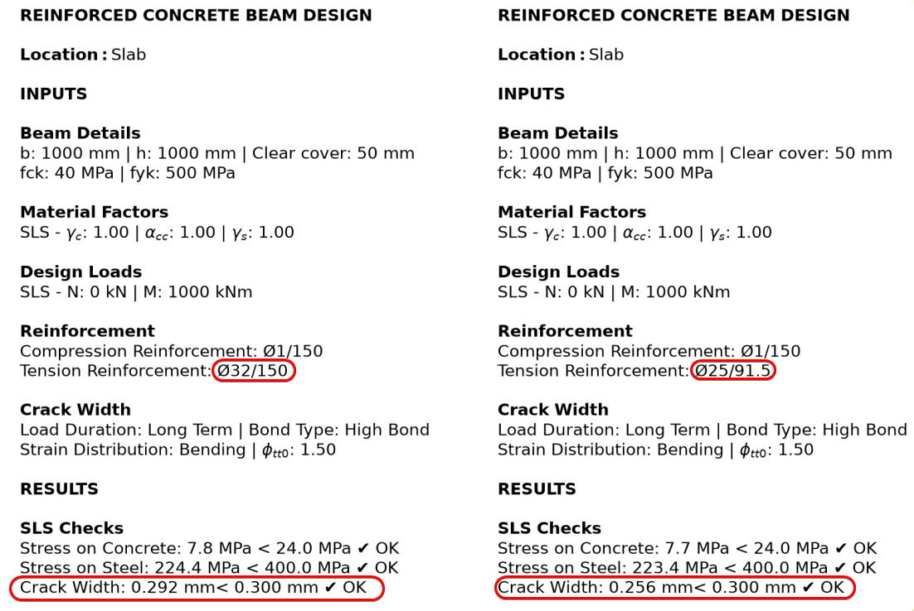
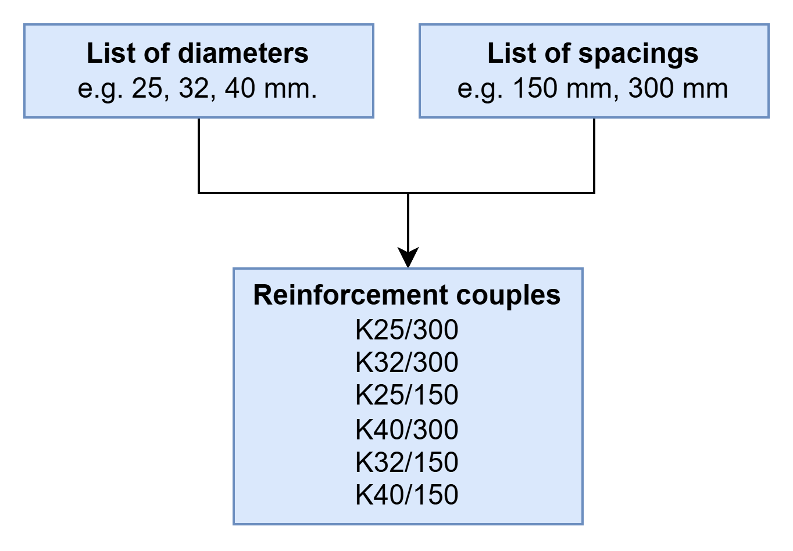
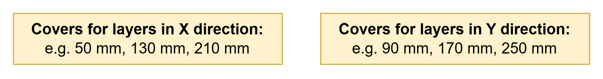
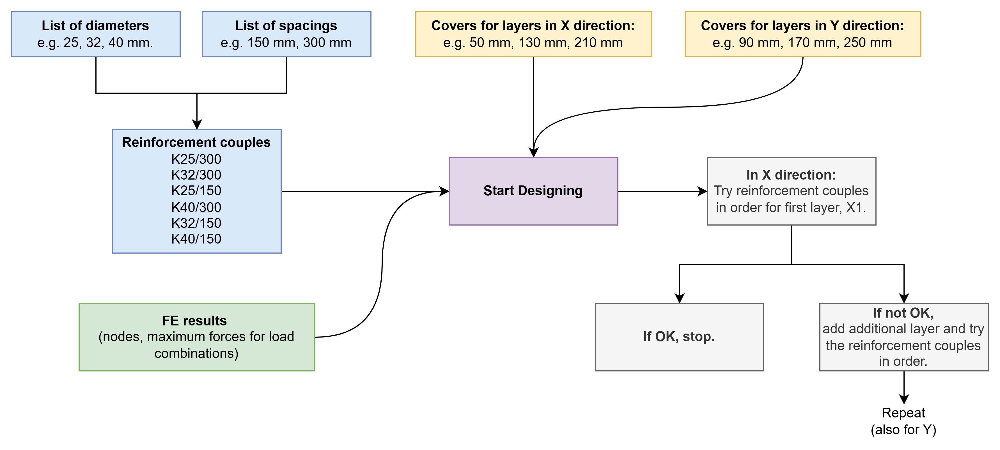
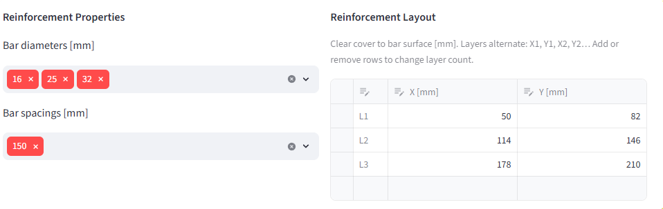
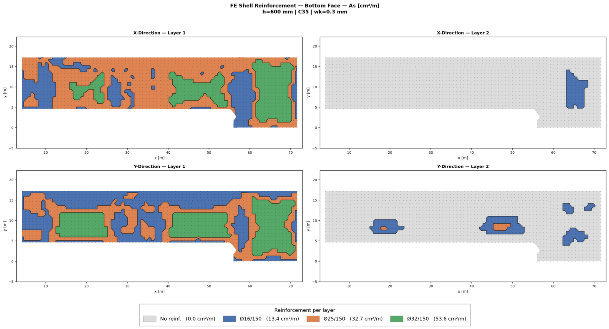

# Problem Statement
I have been trying out different structural FE software to evaluate their automatic reinforcement design functions. For an underground structure, multi-layer reinforcement design in SLS is a must. Surprisingly, most of the STR FE tools cannot handle multi-layer reinforcement very well. Typical problems are:
* Software does not have the capability to add the second or third layer at deeper positions automatically - instead it usually places them at the same depth as the first layer. (FemDesign)
* Software can check multi-layer reinforcement, but it can only check one arrangement - it cannot do an automatic design. (FemDesign)
* Software can do multi-layer design, but only for ULS, it can check SLS for the reinforcement defined by ULS. (RFEM6, FemDesign, Lusas) 
	* I can guess that this is pretty useful for above-ground structures, but for underground structures, SLS usually governs our reinforcement design.

# SOFiSTiK Method
There are a LOT of STR FE tools and I am not claiming that I am aware of the capabilities of all of the ones out there.  (Please reach out if you know more - so I can try them out or I can update the post with new information.) But at least, I know that SOFiSTiK can do multi-layer design pretty well. 

Typical workflow for SOFiSTiK:
* User defines the diameter, minimum and maximum cm2 for a layer and other requirements (crack width etc.)
* SOFiSTiK calculates the srmax based on a given diameter (and also the effective tension depth, which itself shifts with the bar position)
*$$s_{r,max} = k_3 c + k_1 k_2 k_4 \frac{\phi}{\rho_{p,eff}}$$
* Solve for As since the rest (crack width limit, steel stress etc.) are known.

Using this process, SOFiSTiK can produce continuous As maps, required reinforcement area, for SLS. That's great!

## But is this the most suitable way?
Why do we need continuous maps always? Why can't we have discrete maps? Is the actual reinforcement layout continuous? Of course not.
I think the reason is that we love colourful maps, and we just want to keep producing those. You can still have a colourful map with a discrete reinforcement layout. But, continuous is better!
The problem is that those maps do not mean much to an engineer. The engineer still checks for typical reinforcement areas on those maps. They look for 53.6 cm2/m so that they can see where they should put K32/150. We even adjust the colour map ranges to fit the typical reinforcement areas.
In summary, I don't believe continuous maps are in any way better than discrete reinforcement maps. Why do I focus on this? We'll come to that.

## Another problem: Crack width depends on the diameter
Crack width depends on the diameter. As we have seen above, SOFiSTiK provides auto reinforcement design by fixing the diameter.
That's OK - but then, we should write it in bold:

> [!warning] Required reinforcement area map
> **You can use this colourful map only for the chosen reinforcement diameter!**

You cannot just take a map that's been prepared for Ø25 diameter and design a K32/150 reinforcement. It doesn't work that way. As you can see in the comparison below, keeping the area essentially the same (K25/91.5 = K32/150 = 53.6 cm²/m) but changing the diameter from Ø25 to Ø32 raises the crack width from 0.256 mm to 0.292 mm — i.e. the utilisation against the 0.30 mm limit rises from about 85% to 97%.

# Required reinforcement for ULS is simpler
Please be aware - we are discussing the required reinforcement calculation for SLS, not ULS. The ULS side of the discussion is simple, and the reason is fundamental: ULS capacity is governed by the steel *force*, As·fyd — an area times a fixed design stress. The bar diameter enters only through a tiny lever-arm correction (d = h − c − φ/2), so the required area inverts cleanly in one step. Crack width, by contrast, depends on the diameter explicitly through srmax, so "required area" is undefined until a diameter is chosen. For example, RFEM6, FEM-Design and LUSAS can provide the required reinforcement for ULS.
For example, LUSAS says:
>The RC Slab design facility enables calculation of required steel reinforcement areas for ULS loadcases and calculation of crack widths for SLS loadcases.

RFEM6 RF-Concrete Surfaces Manual says:
>In the serviceability limit state, no required reinforcement is determined; instead, the provided
reinforcement is used to determine the actually provided strain ratio.

Design for ULS & check for SLS. That's also what FEM-Design does.

# How to solve this?
I am sure this post will be outdated before long - if I am not already missing methods to overcome this problem already. It might have already been solved in other FE tools that I don't have access to right now.
For my own sake, I am experimenting with a tool. For many years, I have had my own reinforcement calculation code in Python (which you can see in the comparison above). Using that as a basis, I created a FE shell reinforcement tool.

## How does it work?
We provide the list of reinforcement diameters and spacings that we want to use in our design. Based on these diameters and spacings, the code prepares reinforcement couples to try at each node.

For both directions, we provide the cover depth for each reinforcement layer, whether or not it ends up being used.

We also provide the FE results in a spreadsheet which includes nodes and maximum forces for load combinations (providing the pre-reduced maxima keeps the runtime down, but it can also solve for all load combinations).
That's it.
Then the code starts to work. For each node, it takes the force and iterates through reinforcement couples for the given layer depth (and other inputs such as fck, creep factor etc. - all the others required for SLS and ULS calculations.) If it finds a reinforcement couple that satisfies the requirements, it stops. If not, it tries until the maximum reinforcement, and then moves on to the second layer. When the first layer reaches its largest couple without satisfying the checks, it is held fixed at that maximum, and the search begins adding bars to the second layer.
Overall process is shown below.

## In action

As described above, reinforcement inputs (diameter, spacing and cover depths) are provided by the user.

Then, for each node, reinforcement requirements are calculated. Now, the user can see clearly where they need which reinforcement.
And this time, the reinforcement shown in the figure is exactly correct - because we are not working with As, the area of the reinforcement. We are working directly with the reinforcement couples.
Of course, if the user chooses a single reinforcement diameter and varying bar spacings, the results will be the same as SOFiSTiK. However, in real life we usually fix the spacing - not the diameter.

## Why I wouldn't use my tool
Because, I use Wood-Armer method - which takes into account the torsion moments. This is working very well for cases when we have uni-axial bending (i.e. Mx is dominant, My is low), however, when we have bi-axial bending (Mx ≈ My > 0), the principal stress direction (i.e. cracking direction) is not aligned with the reinforcement direction. That means our reinforcement is not working as good as it could. 
Wood-Armer based methods cannot check this. A simple example you can try is a square plate that is fully fixed on all edges with distributed load on top. This slab has a Mx=My>0 and Mxy=0 at the middle. That means, Wood–Armer just hands back Mx and My unchanged, it adds nothing for the diagonal crack. However, if you try Baumann method (which is implemented in most Germany-based packages such as RFEM6 or SOFiSTiK), it will tell you that the principal direction of the cracking is 45 degree to the X and Y. That's why it will need more reinforcement than what you calculate by hand or spreadsheet - and in this case, the tool I presented above.
Replicating Baumann's resulting-direction crack check outside a proper FE package is quite hard, and I can't devote the time to it. So for biaxial bending where the crack direction matters, I rely on the developers of these excellent FE packages to update the tools in near future.
# Conclusion
As I said: this post can be outdated at any moment. These tools are developed at a very fast pace, and there are many I haven't tried (or maybe even heard of). So, if you reach out with information about other software, I will be glad to edit the post to add it.
Otherwise, this is what we need, and I am sure we will get there soon.

