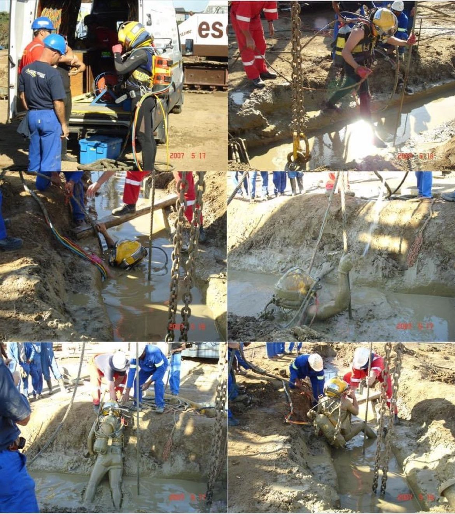

Source: [Scott Roberts](https://www.linkedin.com/posts/scottantonyroberts_memories-from-2007-back-in-durban-building-share-7181386616664449024-6_e1/)
> Memories from 2007 back in Durban, building a 2010 World Cup Stadium; we hit a problem with the diaphragm wall excavation, when the grabber got stuck in the bedrock about -20m down. So we sent commercial divers down through the bentonite slurry to fix a new steel cable to the grabber so we could retrieve it and keep the project going. Those boys were hardcore.

