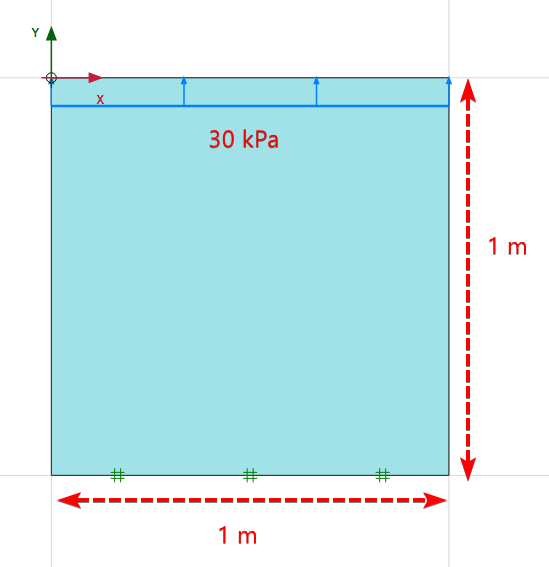
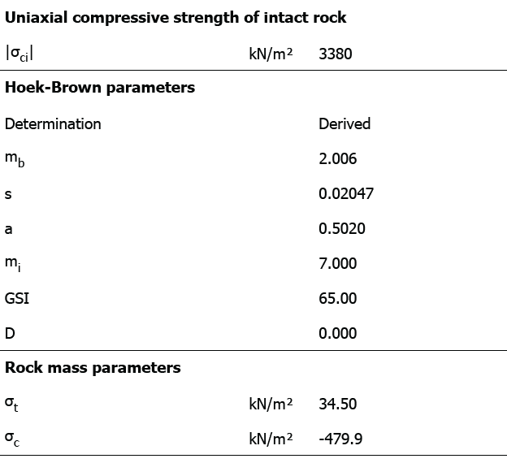
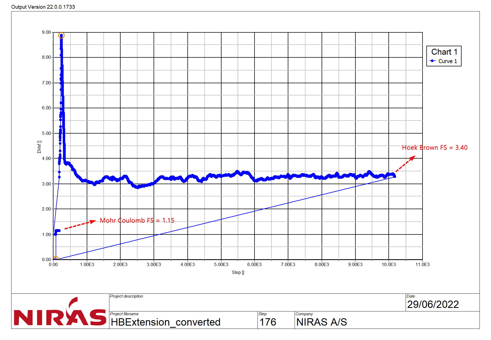
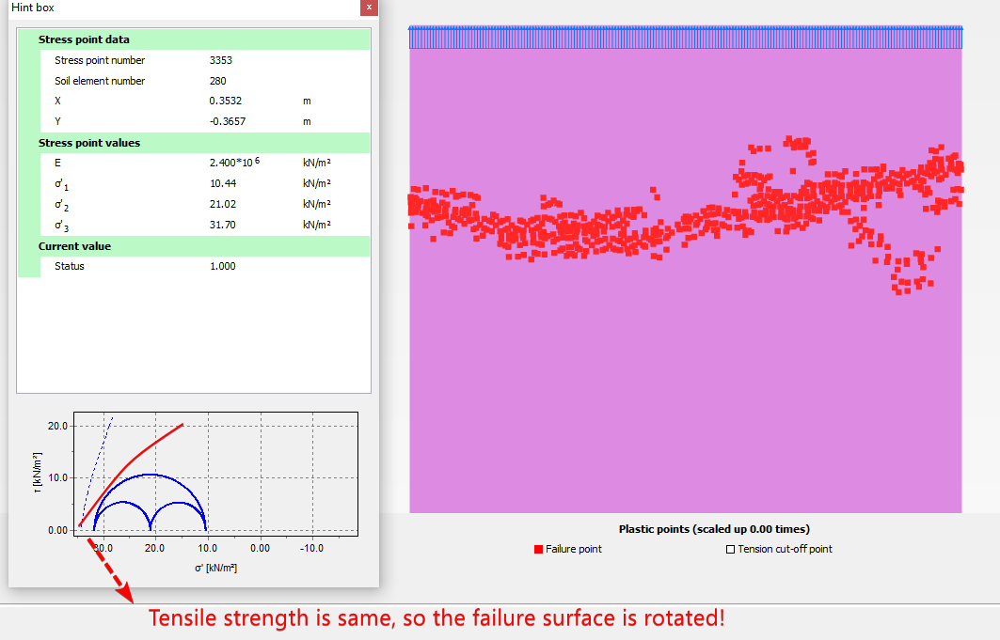
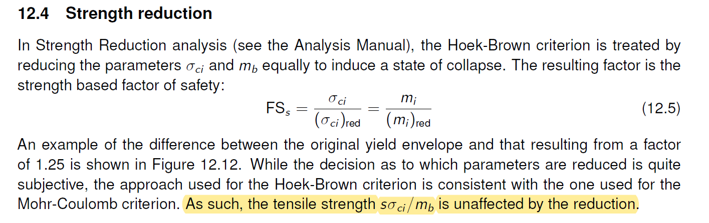
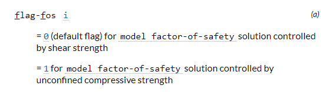
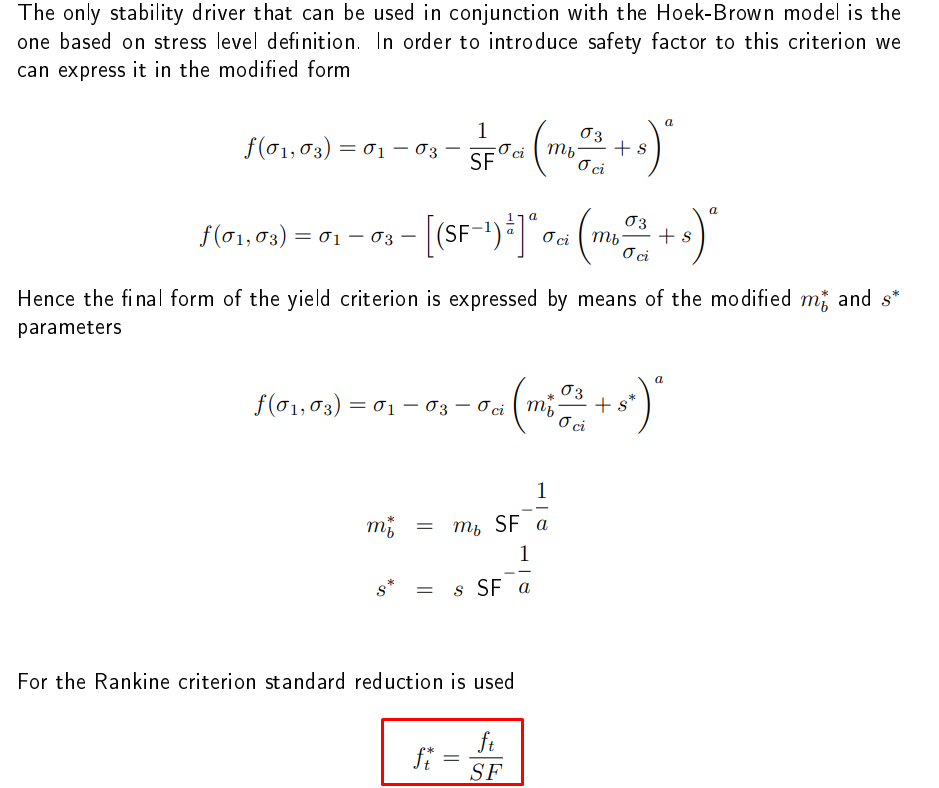

# Update on the Post (13/10/2022)
New update of the Plaxis, partially, solves the problem mentioned in the post below. Now, **if you define a manual tensile strength**, this will be reduced during safety analysis. **But if you rely on the tensile strength automatically calculated by Plaxis**, it will not be reduced and same problem continues for that case, in my opinion. But at least, for the users that are aware of this distinction, there is an option to correctly use Hoek-Brown model.
See the note on [Plaxis](https://communities.bentley.com/products/geotech-analysis/w/wiki/62782/tensile-behaviour-in-the-hoek-brown-model)
# Introduction
This is an investigation of a problem about Hoek-Brown model in FE codes. If you have any addition, test results or correction in my statements, please reach me.
# Problem
Recently, we have been involved with a lot of FE analyses of excavations in rock with my colleagues in Niras. During the embedment depth and sensitivity analyses, we noticed weird behaviour and started small tests.
Our tests showed us a behaviour that worried us - so this article is for people that have dealt with the Hoek-Brown models in Plaxis (or in any FE software) before - especially if tensile behaviour was governing the overall response.
# Test Model
So, the simple test model.

We define two material model - one Hoek-Brown and one Mohr-Coulomb. Stiffness parameters do not matter. For Mohr-Coulomb, enter some strength and for tensile strength, enter 34.5 kPa. For Hoek-Brown, here are the parameters - they result in 34.5 kPa too.

What do we expect if we pull them in extension and make a safety analysis? FS = 34.50 / 30.00 = 1.15. This should be the result. But, in Hoek-Brown, we get 3.40.

# Discussion
There are two questions. Why do we see FS of Hoek Brown much higher than what it is supposed to be and what happens here?
**Why?**
Plaxis does not reduce the tensile strength during safety calculation. Plaxis follows [Benz et. al. (2008)](https://www.sciencedirect.com/science/article/pii/S1365160907000779?casa_token=qadlvOXBaH0AAAAA%3AvuoGK6ybLWLOCj6NWBOjvxtDxmQ9zX6bW2NMgOiqpO9R2gHa1JAzEHV5v9a-KAZUsKgUwqb9Mg) approach and this paper does not talk about tensile strength. Plaxis material manual also does not mention any factorization of tensile strength. If tensile strength is not reduced during safety analysis, what happens?
**What Happens?**
Our guess here is that Plaxis starts to increase the safety factor to find instability during steps of safety analysis. However, even though it increases it to values around 9, it cannot find a instability, because we are looking for a full tensile failure while Plaxis only reduces the compressive/shear strength. When it reduces other parameters but not tensile strength, with the wording of Plaxis support, the failure surface *rotates* around the tensile strength while actually it should both rotate and move to the right, because tensile strength is reduced.
You can see the failure surface with Hoek-Brown. Due to an another bug in Plaxis, you cannot see the updated failure surface in Info viewer, but I have drawn an approximate one with red. So, this is why it fails with an higher value instead of never failing, infinity safety factor.

# Why Should We Care?
If you are analyzing a deep excavation, the bottom of the excavation will mostly resist to tension. In that case, all plug stability will have a different behaviour **if you use safety analysis.**
What can you do until Plaxis corrects it or if you are using an older version? You can reduce the material properties by yourself instead of relying on safety analysis. However, you will be very crude, because you can reduce the UCS of rock. But this is a very conservative approach, because you will be reducing the strength significantly. But, at least, you will be reducing the tensile strength too.
So, this is what we have used as a temporary solution. Dividing the UCS in SLS case by material factor and using that material model as the ULS. You cannot define the safety factor with this approach of course, you can only say if it is above 1 or below 1.
**You shouldn't worry if** you used Hoek-Brown only for slope stability. Because, only the crown of the slope will work in tension.
# What About Other Softwares?
I didn't have time to investigate all the softwares. But, I recommend everyone to make the simple test I described above. I have summarized couple of them below based on the information I get from their manuals:
### Optum G2/G3
Optum should have the same problem as per the information given here. I haven't tested.

### Flac
Flac does not give any information, but as far as I understand from the manuals, it has two FS calculation options. If I should guess, I would say, option 1 should reduce the tensile strength.

### Rocscience
A big congrats to Rocscience.
They define two methods in their manual:
**First one** is applying the safety factor to shear strength. In that case, it recalculates the tensile strength. *"The factored maximum tensile strength, equation 6.9, is calculated based on the new factored generalized Hoek Brown parameters."*
**Second one** is Benz. et. al. (2008) approach that Plaxis also uses. But it seems that Rocscience noticed the problem and warned the users. *"The factored maximum tensile strength in this approach, is the ****same as in the original material****. The intersection of yield criterion with minor principal axis and first invariant of stress tensor will remain the same."*
I don't know if you can choose between these two approaches or how you choose. But, I would assume that there is a toggle for selection of factoring approach just as Flac has.
### Zsoil
Another congrats to Zsoil. They specifically showed the tensile strength reduction in the manual.

# Summary
This problem should be and probably, will be solved just in a short while. But this case proves us that *there can be problems.* Just beware.
