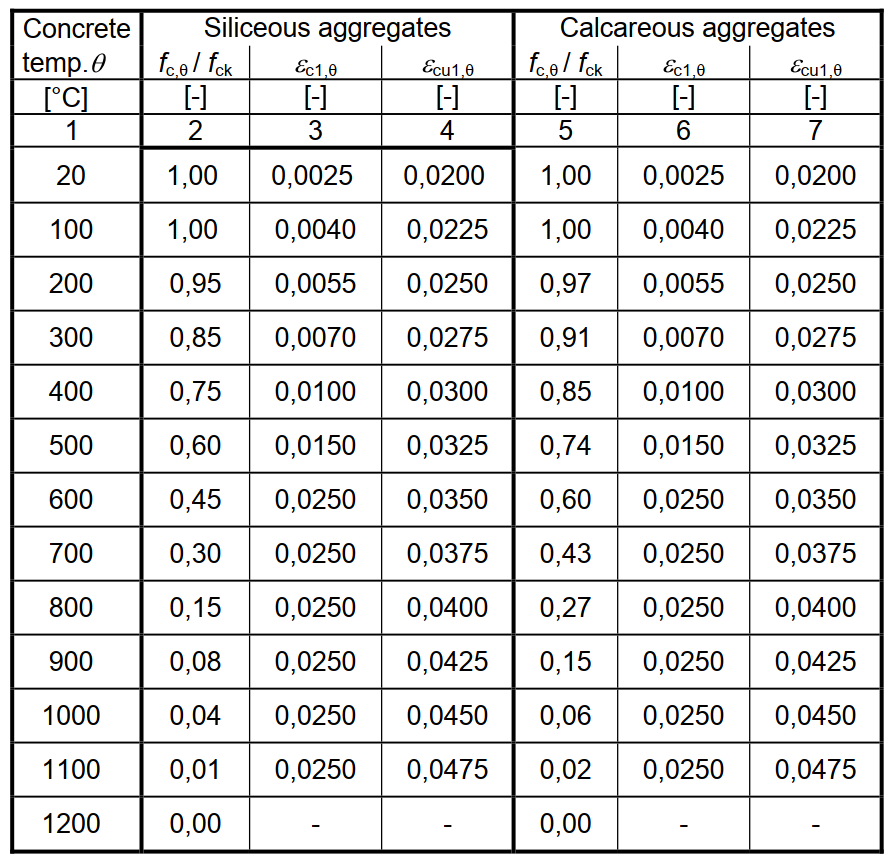
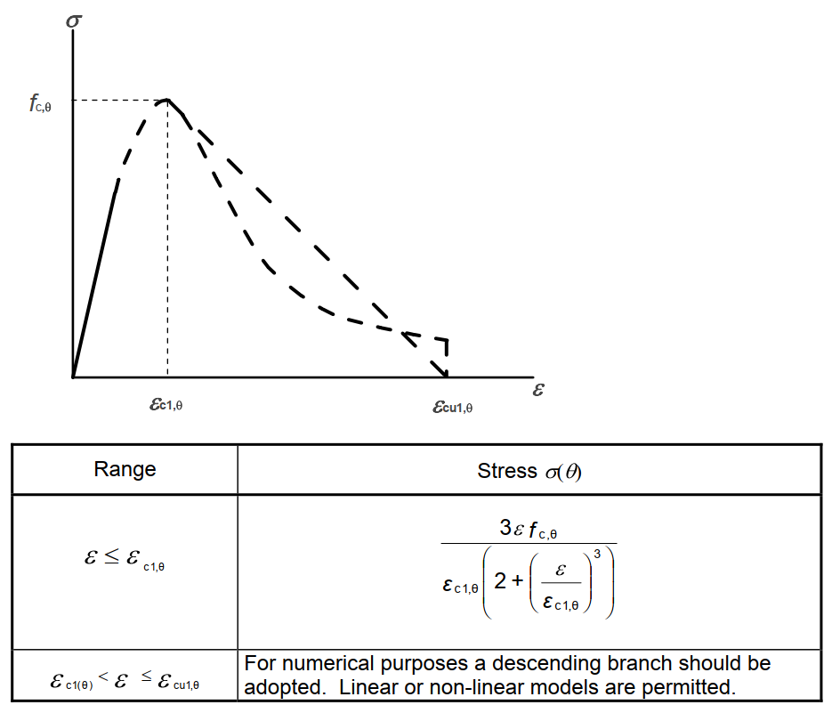
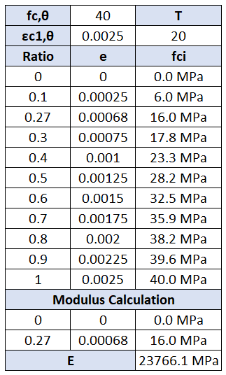
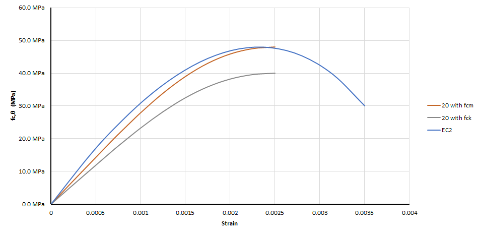
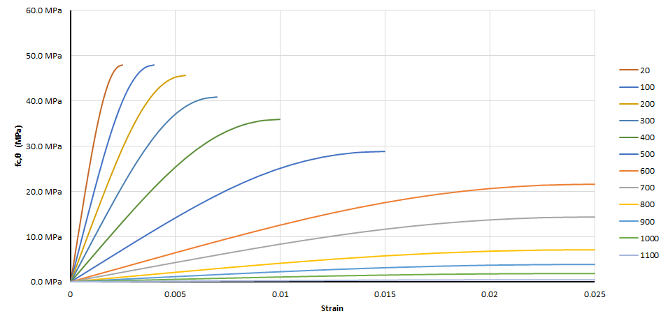
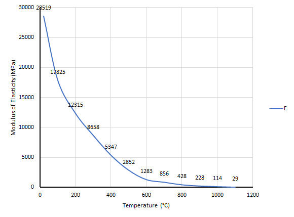
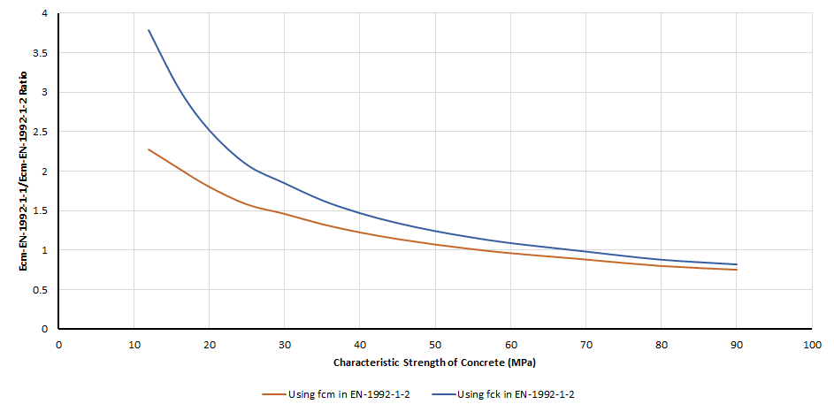
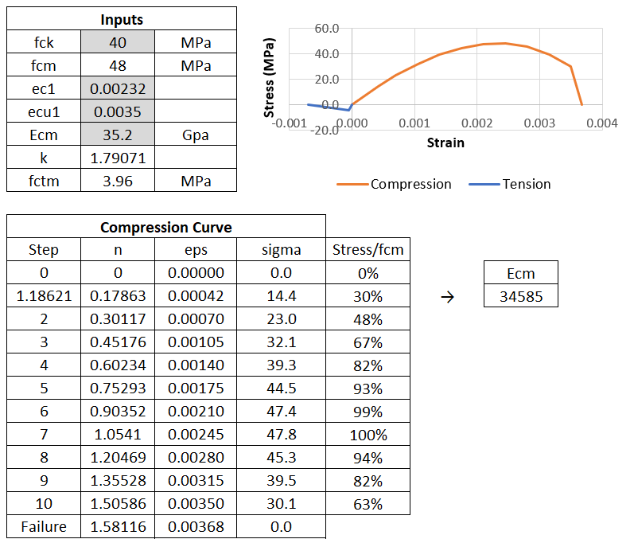
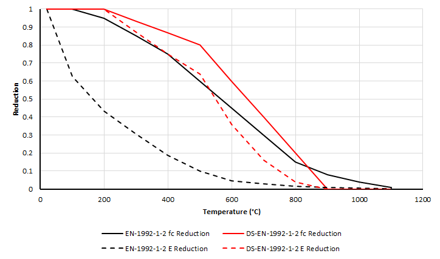

---
title: "Inconsistency Between Eurocodes for Fire Analyses"
date: 2023-03-28T00:00:00+00:00
draft: false
tags: ["Tunnels and Structures"]
---

# Introduction

<u>**Table of Content**</u>

Last month, we had an interesting and long discussion over the email with the creator of PCTempflow, a widely used software for fire analysis, and others like PCSheetPileWall and Framework: [Gerrit Wolsink](https://gerritwolsink.nl/). 
Over the course of the many emails, we have agreed that there is something wrong (or incompatible) in the Eurocodes.
This brief article is our joint effort on clarifying our views on this problem. If you have any input, please feel free to reach out.

# Summary
The article might be hard to follow if the reader has not dived in to the same issues before. Therefore, a brief summary is presented here:
- EN-1992-1-2 (Structural Fire Design) recommendations for stress-strain curve at elevated temperatures are not in-line with EN-1992-1-1.
- This inconsistency might results in **under-estimation **of structural forces during fire, and worse, in case of coupled analysis, both during fire and in statical conditions. (If the software uses the same stress-strain curve at room temperature.)
- There is no direct solution for non-linear analyses aside from tweaking the curves to reach a reasonable stiffness.

For linear analyses, E-modulus degradation recommendations in literature should be taken into account.
- Use of fcm instead of fck in EN-1992-1-2 curves helps, but does not solve the issue. (EN-1992-1-1 uses fcm, EN-1992-1-2 uses fck).

# Problem Statement
EN 1991-1-2 clarifies the requirements for **structural fire design. **For a proper fire analysis, we need at least two of the stress, strain and stiffness of concrete **at elevated temperatures. **EN 1991-1-2 gives us the strength degredation with increasing temperature as a table and stress-strain relationships at elevated temperatures. 

EN 1991-1-2 does not have any recommendation for stiffness and we know that we can calculate the stiffness of the concrete by dividing stress to strain. The problem starts here.
## Stiffness using EN-1992-1-2 Approach
All comparisons throught the article will be performed for C40/50 concrete with siliceous aggregates. 
**The main problem**
> [!note] 📌
> Stiffness at room temperature calculated by EN 1992-1-2 stress-strain diagram is **not equal **to EN-1992-1-1 recommendation. 

Let’s do this for C40 concrete. As per definition in Eurocode, the stiffness is secant stiffness measured from approximately 40% of the fck. Of course we do not expect to reach the exact E-modulus in Eurocode, but difference is significant. 
Compared to **35 GPa at EN-1992-1-1 for C40 concrete**, the calculation using EN-1992-1-2 results in **23.7 GPa**.

## fck vs. fcm?
As shown in the figure from EN-1992-1-2 in the previous chapters, the EN-1992-1-2 refers to fck when presenting the compressive strength degradation at elevated temperatures. Therefore, reader has to select the fck, reduce it based on the temperature and then, use it to derive the stress-strain diagram.
However, this is not the case in EN-1992-1-1, we use fcm = fck + 8 MPa.
Therefore, our interpretation is that this is due to a mistake in the standard and users should derive the stress-strain relationship using fcm. When same calculations are carried out using fcm with stress-strain relationship recommended in EN 1992-1-2, the results are still far off from EN 1992-1-1 with E = 28.5 GPa. So, the first note:
> The stress-strain diagram of EN 1992-1-2 should be drawn for fcm, not fck, although the standard refers to fck.

But there is still difference between room temperature stress-strain diagrams of EN 1992-1-1 and EN 1992-1-2 ***which results in E value of 35 GPa vs. 28.5 GPa, respectively.***

## Comparison of Stiffness at Elevated Temperatures
If we draw the same stress-strain diagram for all temperatures with fcm, we get something like this.

If we calculate the modulus of elasticity for each temperature level, we get the following:

Note that the difference between Ecm calcualted by EN-1992-1-1 and EN-1992-1-2 at room temperature is more pronounced at lower strengths. A comparison with the methods are shown below for both EN-1992-1-2 methodology, fck and fcm.

# Implications
> [!note] 📌
> The stiffness of the structural elements are much lower during fire analysis. The structural forces calculated by the software will be significantly lower than actual.

EN 1992-1-1 stress-strain curve does result in a modulus close to the recommended modulus of the same standard as shown below. The methodology is also described clearly in FIB Bulletin 42. So, the problem is only with the stress-strain curves recommended by the EN 1992-1-2.

# Literature
After our discussions, our literature investigation has resulted in very little arguments about this inconsistency. Authors from Ukraine ([Fomin et. al. 2017](https://www.researchgate.net/publication/318320250_Improvement_of_the_mathematical_model_of_the_diagram_of_deformation_of_the_compressed_composite_steel_and_concrete_structures), [Fomin et. al. 2021](https://iopscience.iop.org/article/10.1088/1757-899X/1021/1/012013/pdf)) observed similar inconsistency.
# Workaround
There is not a clear solution for non-linear analyses. Because, in non-linear analyses (such as Hydra in Sofistik), the stress-strain diagram should be defined. We are not sure how the software jumps from static case (EN-1992-1-1) to fire case (EN-1992-1-2), but:
- **If the non-linear analyses are not coupled completely: **Software is probably using two different curves - one for static analyses (EN 1992-1-1 curve) and one for fire analyses (EN-1992-1-2 curve). This partially decoupled approach reduces the error since static analyses are carried out with correct stress-strain diagram.
- **If the non-linear analyses are coupled: **(meaning both fire and static load cases are solved simultaneously), the error in the results will be more pronounced since the static analyses will be carried out at t=0 with (most probably) stress-strain diagram taken from EN-1992-1-2 for room temperature.

For linear analyses, however, if the user can feed time-dependent stress and stiffness, the problem can be solved easily by adapting a E-modulus degradation curve from literature. For example, Danish Annex of EN-1992-1-2 proposes a different reduction in fc with temperature, and recommends square of the reduction in fc for E-modulus reduction. Comparison is shown below.
However, we should state that the this solution is not *legal *in terms of contractual requirements, because EN-1992-1-2 gives us the stress-strain diagrams which does not leave any discussions regarding using a different Ecm. 
Lastly, in addition to the discrepancy between EN 1992-1-2 and EN 1992-1-1 regarding the E-modulus at room temperature, the large scatter in experimental results at higher temperatures reported in the literature means that no unambiguous solution is likely available.

