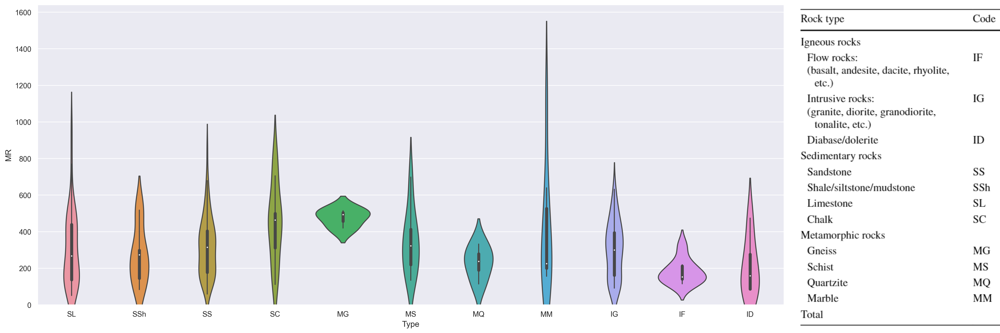

A new paper from Tatone et. al. is published [here](https://link.springer.com/article/10.1007/s00603-021-02759-7).
Using the data of the authors, following violin graph is drawn to estimate **Modulus Ratio (MR = E / UCS)** of the different rocks.
Update: [Aly Abdelaziz](https://github.com/alicarlos) has proposed an update on the code and graph. Thanks to him, it looks better now.

Code and data are in the [Github Gist](https://gist.github.com/berkdemir/2799253491835776555e36c3a5b09ddd).
```python
# Data from Tatone, B. S., Abdelaziz, A., & Grasselli, G. (2022). Novel Mechanical Classification Method of Rock Based on the Uniaxial Compressive Strength and Brazilian Disc Strength. Rock Mechanics and Rock Engineering, 1-5.
import pandas as pd
import seaborn as sns

# Rock Category
rock_type = {"Sedimentary": ["SL", "SSh", "SS", "SC"],
             "Metamorphic": ["MG", "MS", "MQ", "MM"],
             "Igneous": ["IG", "IF", "ID"]}

ordered_box_list = []
for i, v in rock_type.items():
    ordered_box_list += v

df = pd.read_csv("data.csv")

df = df[df.E != "-"]
df = df.astype({"E": float, "UCS": float})

df["MR"] = df["E"] / df["UCS"] * 1000

sns.set(rc={"figure.figsize": (20, 8.27), "figure.dpi": 300})

ax = sns.violinplot(x="Type", y="MR", data=df, order=ordered_box_list)
ax.set_ylim(0)
```
The data.csv file can be saved from here or from Gist.
[[Notion/Quick Note/BDEM (1)/Blog Posts/_assets/data.csv]]
