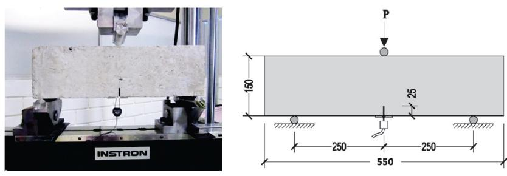

Crack propogation during three point bending beam test using Concrete model in Plaxis. In this case, we have tried to capture the behavior of steel fibre reinforced concrete and results are really promising.
<video controls style="max-width:100%"><source src="Bending_Beam_Test.mp4" type="video/mp4"></video>
The actual photo of the 3 point bending beam test is shown below from [Buttignol et. al. (2008)](https://www.scielo.br/j/riem/a/3FH99MRnvSLHXrBY5Rg8j9p/?lang=en).

