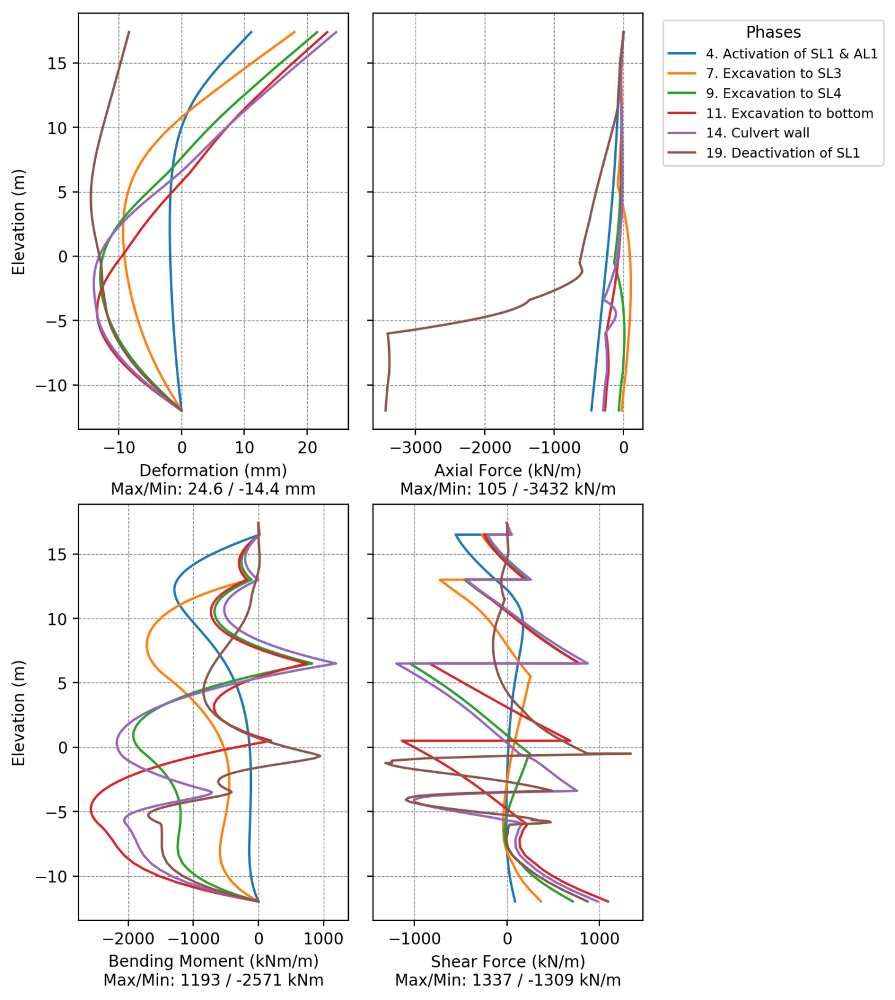

The beauty of **Streamlit **with **Plaxis **is the simplicity of the UI and how minimalistic it looks. Also, the 2x2 output figure for a retaining wall is the most compact output you can imagine. Everything you need to show for all these stages is inside one figure. Moreover, this tool can deliver a really detailed excel sheet to share with other designers.
[[Notion/Quick Note/BDEM (1)/Blog Posts/_assets/Example Excel Output Format for Plates.xlsx]]

Watch the video to see it on action:
<video controls style="max-width:100%"><source src="Screenshot-20230806-1599.mp4" type="video/mp4"></video>
Also fixed-end anchors and node-to-node anchors!
<video controls style="max-width:100%"><source src="Screenshot-20230806-1600.mp4" type="video/mp4"></video>
<video controls style="max-width:100%"><source src="Screenshot-20230806-1601.mp4" type="video/mp4"></video>
And lastly, **how to start the Streamlit directly from Plaxis as shown in videos:**
```python
import streamlit as st
from streamlit.web import cli as stcli

if __name__ == "__main__":
    if st.runtime.exists():
        main()
    else:
        sys.argv = ["streamlit", "run", sys.argv[0]]
        sys.exit(stcli.main())
```
