# Before Introduction
This is the paper we have written with my dear wife Pinar Akdogan Demir, based on our experience from Istanbul tunnels. I was already considering uploading the paper here, but when I saw that my paper was not inside the proceedings USB due to a mistake (which also was almost preventing me from presenting - because they simply forgot us), it was a must. So, here it is. As always, get in touch if you have any comments.
# Introduction
Due to comprehensive soil-structure interaction during and after tunnelling, estimation of structural forces on the linings depends on many factors which can be categorized into ground properties, structural properties, and loading properties. Estimation of ground properties has been discussed in the literature in detail and proper modelling of tunnels or any other structure that interacts with ground requires in-depth knowledge of ground properties. In geotechnical engineering, structural properties are thought to be rather well known, however, due to the strictly time-dependent excavation and loading process, even structural components cannot be represented by simpler constitutive or structural models.(Neuner, Cordes, et al., 2017; Neuner, Gamnitzer, et al., 2017; Schädlich et al., 2014; Schädlich & Schweiger, 2014) Static loadings on the tunnels are also discussed in detail and it is either represented by stage-by-stage modelling using finite element method (FEM) or finite difference methods (FDM) or empirical formulations such as Prodotyakonov, Terzaghi, and others to be used on beam-on-foundation solutions. (Celada & Bieniawski, 2019; Széchy, 1967; Terzaghi, 1943) Seismic forces, on the other hand, may impose the greatest load on the tunnels based on the seismicity of the project location. (Kontoe et al., 2008; Roy & Sarkar, 2017; Z. Z. Wang & Zhang, 2013; Zhang et al., 2018) Behaviour of underground tunnels differs significantly from above-ground structures due to complex interaction with the ground around it. (Hashash et al., 2001; Tsinidis et al., 2020)
Although theoretical studies present a great deal of material to estimate seismic forces on the tunnels, there are still important points to be considered in the daily design. In this paper, practical seismic analyses of tunnels will be discussed along with recommendations for practice.
# Seismic Loads on Tunnels
## Available Methods
There are several up-to-date methods to calculate the structural forces on tunnel lining which are summarized in the table below.
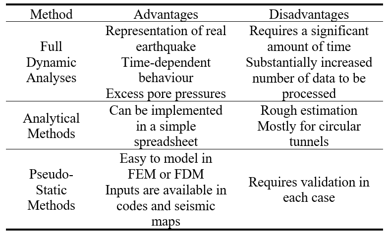
Full dynamic analysis is, currently, the most advanced method that is available to both practitioners and academics. In this method, earthquake excitation is applied from the bottom boundary of the model and this boundary usually extended up to bedrock to reduce the steps to move the earthquake from bedrock to an upper level using an additional step of site response analysis. Since dynamic analyses are more sensitive to model conditions, the effects of boundary distance and mesh size are significant. (Fabozzi, 2017; Tsinidis, 2015) It is also advisable to use advanced constitutive models such as Hardening Soil Small Strain model which takes the stiffness-strain degradation relationship and damping into account.
Analytical methods are very easy to use and proven to provide a reasonable estimation of earthquake induced forces on the lining. (Hashash et al., 2001; J. N. Wang, 1993) However, analytical methods require crude simplifications such as circular geometry and monolithic lining. To account for joints of segmental lining of TBM tunnels, following simplified approach can be used. (Wood, 1975)
$$
I_{eqv}=I_{joint}+I_{seg} (4/n)^2
$$
Ieqv is the equivalent moment of inertia of the tunnel ring composed of joints and segments, Iseg is the moment of inertia of the segments (full section), Ijoint is the moment of inertia of the joints and n is the number of joints. Joint thickness is the clear concrete thickness after gasket.
Compared to full dynamic analyses and analytical methods, pseudo-static methods are in between of these methods in terms of both advantages and disadvantages. Pseudo static methods can be divided into both deformation-based methods and force-based methods. Pseudo-static force-based methods such as prescribed acceleration can be a fast approach to seismic problems. However, since ovalling is the main reason of the seismic loading of underground structures, uniform acceleration profile may result in incorrect loads. Therefore, it is advised to check the response of model without tunnels to ensure the strain profile is correct.
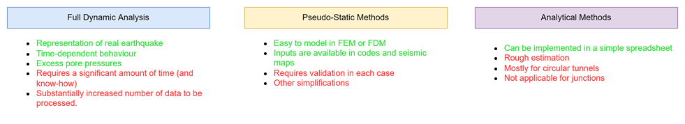
## Pseudo-Static Deformation Method
Pseudo static methods can be used with reasonable accuracy to estimate seismic tunnel lining forces. The main idea behind the pseudo-static deformation method is imposing ovalling deformation to whole model without any prior assumption about racking coefficient.
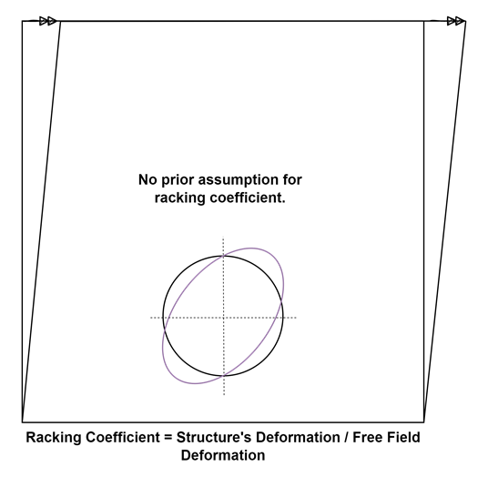
Concept of pseudo-static deformation method is developed by Newmark (1968) and simplified derivation of strain due to waves is described below.
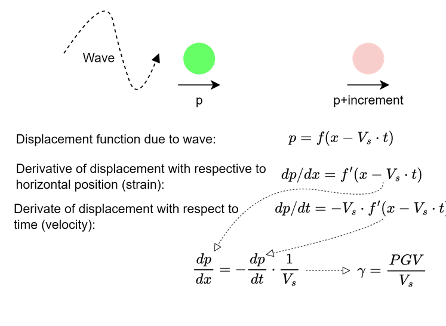
In this equation, PGV is the peak ground velocity (m/s) and Vs is the shear wave velocity (m/s). Different notations (Vs for PGV and Cs for Vs) are available in the literature.
Since PGV depends on the depth and shear wave velocity depends on the level of strain, effective parameters can be used for better notation:
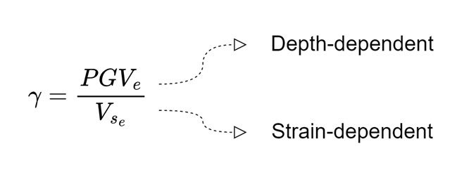
PGVe is effective peak ground velocity for the depth in consideration and Vse is the effective shear wave velocity calculated for the expected strain level.
## Effective Shear Velocity
There are several guidelines for the reduction of shear wave velocity based on the earthquake level and ground strength. For the ratio of effective shear wave velocity to maximum shear wave velocity, FHWA-NHI-10-034 (Hung et al., 2009) recommends 1.0 for rock and 0.6 to 0.8 for stiff to very stiff soils. For softer soils, site-specific soil response analysis is recommended. Eurocode 8-5 (European Standard, 2004) presents recommendations for soils with shear velocity smaller than 360 m/s. For ground acceleration ratio between 0.1 to 0.3, reduction ratio decreases from 0.9 to 0.6.
Since shear wave velocity level depends on the shear strain, effective velocity can be reasonably estimated using modulus reduction curves utilizing the relationship between shear wave velocity and shear modulus:
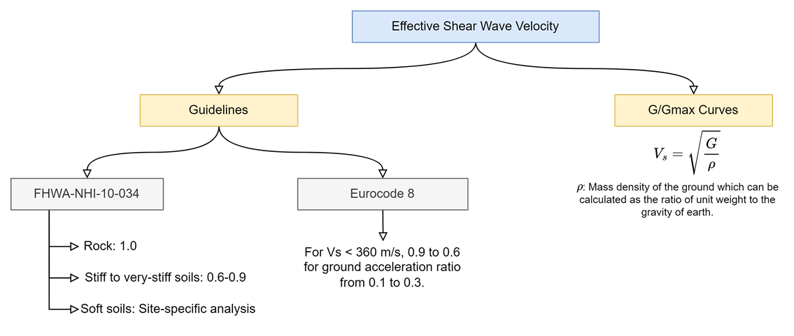
To calculate the reduction of shear modulus and shear wave velocity for soils and rocks, an iterative approach is proposed based on the seismic shear strain.
Darandeli (2001) curves can be used due to the validity of the approach for both sands and clays.
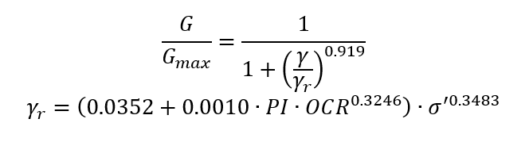
In this equation, PI is the plasticity index (%), OCR is over-consolidation ratio and σ' is effective pressure (atm).
For rocks, Schnabel (1973) curve can be approximated by the following equation with reasonable accuracy, R2=0.99.
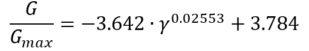
Since shear velocity depends on the square root of shear modulus, the following iterative approach can be used
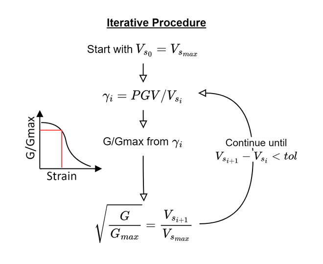
Iterative approach is used to calculate shear wave velocity reduction factors using both modulus reduction methods and presented as design charts in the following figures. These charts can be used in daily practice for estimation of reduction of shear wave velocity. It should be noted that Darendeli chart has been derived for OCR=1 and effective pressure = 2 atm. A simple Python code is also given in a Github repository to use to estimate effective shear wave velocity: [https://github.com/berkdemir/Effective-Shear-Wave-Velocity](https://github.com/berkdemir/Effective-Shear-Wave-Velocity)
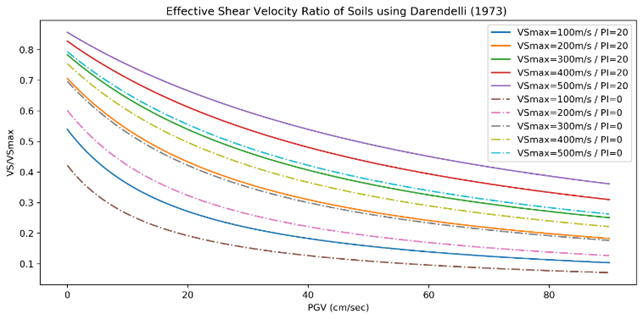
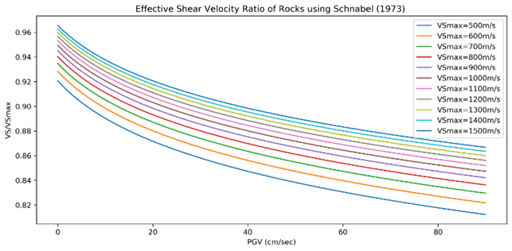
## Effective Peak Ground Velocity
Peak ground velocity (PGV) is the main parameter to estimate seismic demand for underground structures since transient ground strains can be expressed using ratio of PGV to Vs based on the concept by Newmark (1968). Researches have shown that damage distribution of underground structures can be better correlated with PGV compared to PGA. (Kongar & Giovinazzi, 2015; Pineda-Porras & Najafi, 2010)
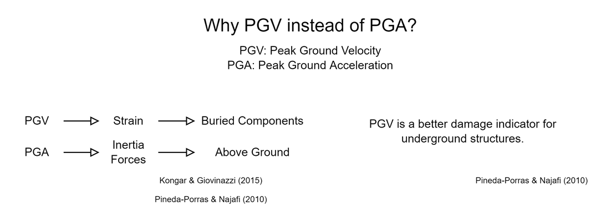
Compared to other seismic parameters, there are very few methods to correlate PGV with other seismic parameters. Bommer and Alarcon (2006) have discussed a number of correlations available in literature. Aside from correlations, it is quite common for metro projects to take advantage of site-specific probabilistic seismic hazard assessment (PSHA) reports. However, in the absence of PSHA, several approaches from literature are proposed here due to ease of use with local codes and seismic maps. All parameters can be obtained after calculation of response spectrum which is standard practice for all projects. It should also be noted that Bommer and Alarcon (2006) have criticized the use of S1 for estimation of PGV based on their data, however, since FHWA (Hung et al., 2009) is widely accepted in practice, the proposed correlation of FHWA is included. The correlation by Paolucci and Smerzini (2018) includes both short and 1 sec spectral acceleration and the proposed correlation is also recommended by recent guideline on seismic design of tunnels published by Ministry of Transportation and Infrastructure of Turkey (2020). PGV/PGA ratio quoted by Hashash et. al. (2001) is also widely used, but not included in this study. Table below summarizes the recommended correlations for peak ground velocities.
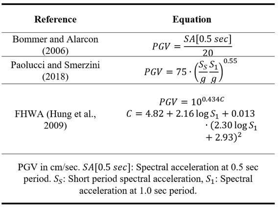
For underground structures, table below is recommended by FHWA (Hung et al., 2009) to reduce the earthquake demand based on the tunnel depth.
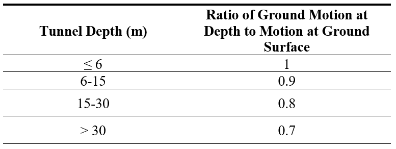
FHWA-NHI-10-034 refers to Chang et. al. (1986) to support the reduction of ground motion parameters with depth, however, the referred study investigates the depth of nuclear reactors between 20 ft and 40 ft. Therefore, there is not clear information on how the recommendations are derived. To investigate this approach, nonlinear site response analyses are carried out using DeepSoil (Hashash et al., 2020) for a 250 m deep soil column with shear wave velocity increasing from 200 m/s to 800 m/s. Darendeli equation is used for modulus reduction and damping curves with PI=20, OCR=1. Selected earthquakes are summarized in Yee (2017).
Nonlinear site response analysis results are presented in the left side of the figure below by normalizing the peak ground accelerations at each depth by accelerations at the ground surface which allows comparing the results with FHWA recommendations. Results show that except for four records, FHWA recommendations match the calculated reduction ratios reasonably. However, for Kobe, Loma Gilroy 2, Mammoth Lake, and Parkfield motions, ratio of PGA at surface to PGA at depth increases over 1 compared to values lower than 1 suggested by FHWA.
To investigate this, equivalent linear analyses are also performed, and results are presented in right side of the figure below.  Equivalent linear analyses result in closer values to FHWA recommendations compared to nonlinear analyses.
The main reason behind the difference between the nonlinear and equivalent approach is the failure of soils closer to the surface. Due to the failure of soils closer to the surface in the nonlinear approach, ground motions are deamplified which results in higher ratios. Based on this comparison and available tools during the referred studies, it is reasonable to conclude that FHWA approach may have been developed based on equivalent linear or linear approaches. However, the outcomes of nonlinear analyses should not be disregarded. For high intensity, high PGA earthquakes, and low strength soils, the use of FHWA recommendations may be under-conservative.
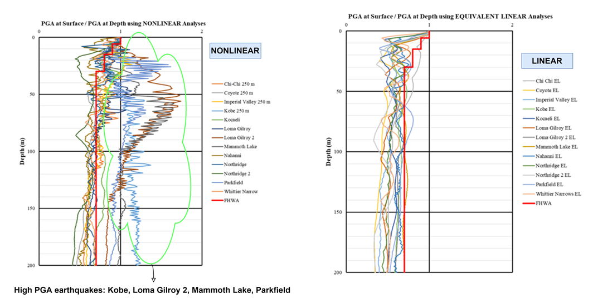
## Finite Element Modelling of Pseudo-Static Deformation Method
Deformations due to seismic loading should be applied to finite element model to simulate ovalling of underground structures due to seismic waves. However, the effects of imposed deformation should be carefully checked to validate that underground structures receive seismic loads. However, there are many factors that should be considered which will be detailed in the next chapter. In this part, the recommended procedure for imposing prescribed deformation on the finite element model will be presented. The recommendations will be given for Plaxis 2D V20, however, similar recommendations should apply to other FEM and FDM with small differences.
Strains calculated using the procedures described before will be used to calculate the necessary amount of deformation to be imposed on the model. To properly simulate the earthquake deformations, Z-shaped or triangular prescribed deformations at vertical boundaries can be used (Fabozzi, 2017; Tsinidis, 2015).
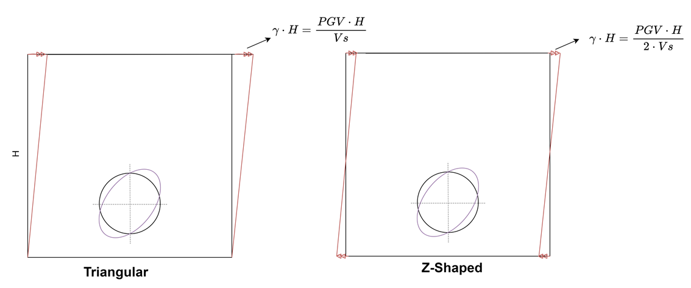
As long as a uniform total strain is obtained at the centre of the model, any deformation profile at vertical boundaries can be accepted such as “Z” shape with$\gamma_{max}H/2$ at the top and $-\gamma_{max}H/2$ at the bottom. However, it should be noted, in this case, uniform deformation profile should be applied in opposite direction to the top boundary too. It should also be noted that comparative analyses show that Z shape deformation profile results in shorter calculation time and lower number of calculation steps compared to triangular deformation profile. To properly “bend” the model in direction of applied deformation, it is suggested to fix the top boundaries at y direction.
Figure below shows the recommended deformation profile in a finite element analysis.
Due to shortcomings of some of available FEM codes, designers may choose to adapt different methods to simulate deformation. The methods to be chosen can be shaped based on the know-how of each designer as long as the imposed deformation profile is validated.
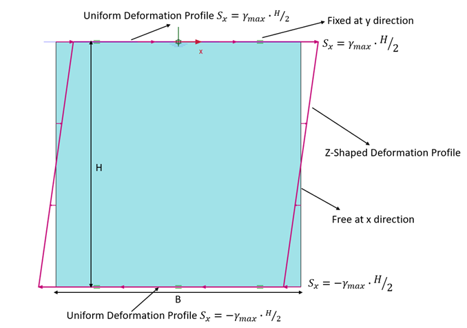
Pescara et. al. (2011) uses rigid plates at vertical boundaries and iteratively determined force at the top and bottom of plates to bend the model. However, presented deformation profile in the paper shows that deformation is localized at the corners which may be unrealistic and resulting seismic forces may deviate from the “true” forces.
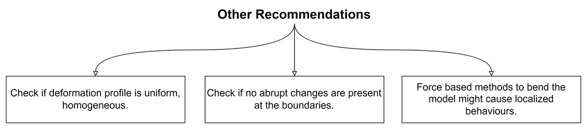
Wang et. al. (2005) have recommended a detailed procedure for pseudo-static deformation on finite element models. Using similar approaches, the deformation profile at the centre of the model should be compared with the applied free field deformation before including the tunnel in the model.
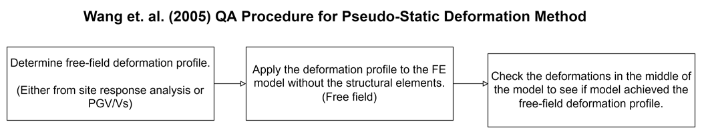
Similar recommendations can be applied to 3D models. In this case, prescribed deformations should be applied on all sides with same assumptions.
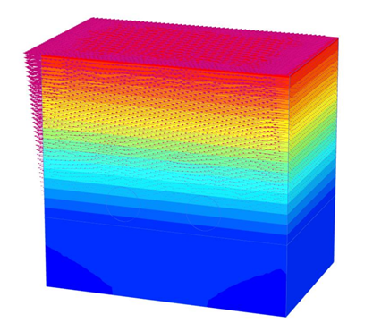
# Sensitivity of Pseudo-Static Deformation Method
The behaviour of the model response depends strictly on the stiffness and strength of the medium. In case of a linear elastic soil, imposed deformations are uniformly distributed to all model regardless of the width, however, linear elastic soil behaviour assumption does not hold true for most soils and rock except very hard rocks.
Boundary effects on finite element models are well investigated in literature for static and full-dynamic analyses. However, there are very few comments on pseudo-static deformation methods. Tsinidis (2015) compares the pseudo-static deformation method with full-dynamic analysis and finds that the simplified method underestimates the lining forces. Author, correctly, proposes that large distance between boundary and tunnel lining may act as an absorbent and “relieve” the strains on soils. Fabozzi (2017) uses 3D clear distance between lining and boundary for pseudo-static method and 8D for full-dynamic analysis.
The relieving effect of soils between lining and boundary depends on, at least, the following factors: (For figures to compare the different properties of FE models, following notations are used: W – Width of the model (m), c: Drained cohesion (kPa), fi: Drained friction angle (deg), E: Drained elasticity modulus (kPa), D: Depth of model (m).)
## Distance between boundary and lining:
With decreasing model with, deformation profiles at the centre are closer to the applied deformations as shown in following figure. However, it may not be possible to keep the boundary reasonably narrow since it will also affect the static forces due to boundary effects.
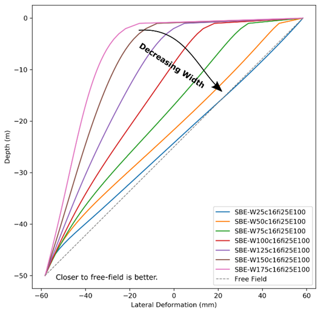
## Strength and stiffness of the soil
Strength and stiffness affect the model behaviour significantly. Relieving effect on the free field deformation profile decreases with increasing strength. In case of linear elastic soil, there is no relieving effect. However, for softer soils, model width plays an important role on the deformations. Figure below shows the effect of these parameters on the deformation profile.
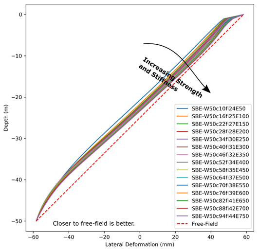
## Aspect ratio of the model
The aspect ratio (Depth / Width) of the model is the primary property that can be easily manipulated to obtain correct free-field profile without affecting the static calculations and constitutive models. Based on a number of analyses in Plaxis 2D with softer soils which are summarized in Figure 8, it is recommended to keep the aspect ratio equal or above 2. It should also be noted that if the rock profile is below 1.4-2.2D below the tunnel (Möller, 2006), model can be extended to infinite depths using the same soil profile without affecting the results since the bedrock effect on the tunnels will be negligible.
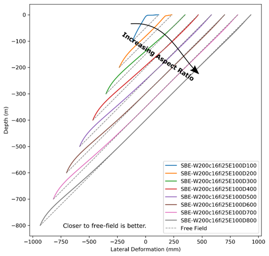
## Overall Behaviour
Summary of the conclusions from the three sensitivity analyses is presented in the following figure.
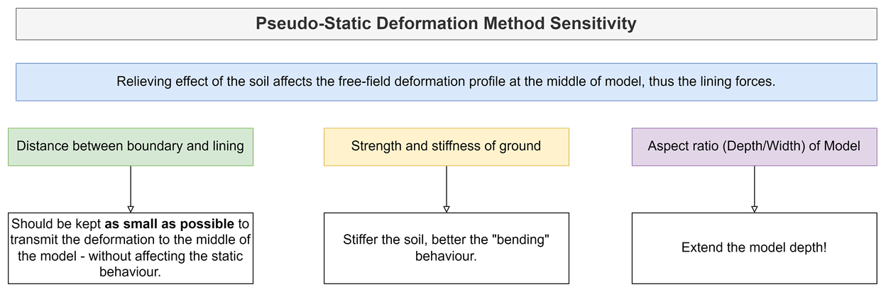

As it can be observed from previous three chapters, overall behaviour of the model is similar to a beam. As the beam's flexural rigidity increases, bending becomes more homogenous, as intended.

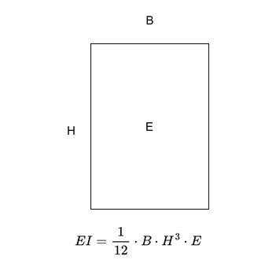
# Comparison of Pseudo-Static Method with Analytical Methods
A simple comparison between pseudo-static deformation method implement in FE and analytical method of Wang (1993) is presented in following figure. Due to limitation of space (which was important for WTC 2022), details of the model are not described in length. However, a simple comparison shows that using the recommended procedures, results of FE analyses agree with the analytical methods for circular linings. In cases where analytical methods fall short, pseudo-static methods provide an easy way to analyse tunnels in seismic conditions.
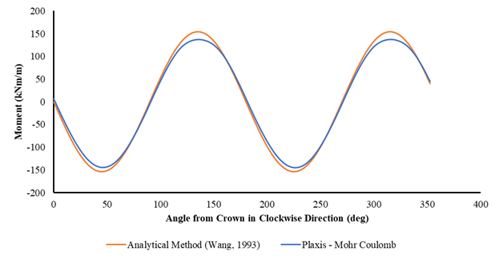
As mentioned by Wang et. al. (2005), it is important to check the applied lateral deformation profile before the tunnel due to expected distortion of deformation profile with the inclusion of tunnel. Results of FE analysis in soft soil with and without the tunnel in shows the effect of tunnel on deformation profile.
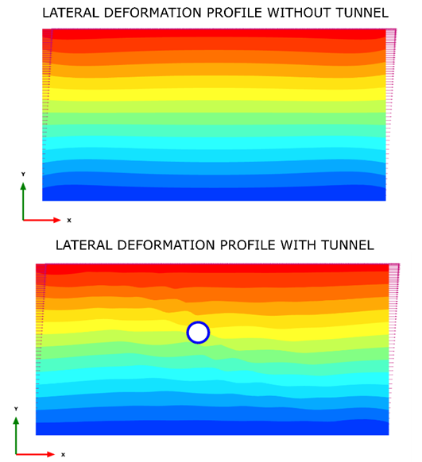
# Conclusion
Permanent linings of sprayed concrete lining (SCL) and TBM tunnels are designed to withstand both ground loadings, water loads and seismic loads in addition to temporary loads. Due to the symmetric nature of ground loads, in the seismic regions, seismic loads govern the tunnel design mostly.
Seismic design of tunnels mainly based on the keystone papers in the literature with limited practical demonstration. This paper aims to close the gap between research and practice.
Recommendations are given in the paper regarding the selection of seismic parameters as well as FEM models. Effective shear wave velocity and peak ground velocity are the main parameters to determine the demand on the structures. The ratio between effective and maximum shear wave velocity can be determined based on modulus reduction ratio curves in literature with an iterative approach. However, widely accepted rules for peak ground velocity reduction with depth should be re-evaluated for soft soils – high seismicity and 1D site response analysis should be used when needed.
To apply pseudo-seismic deformation method in FEM and FDM, it is important to apply a quality control procedure to check if strains are applied at the centre of the model. Several recommendations are presented in the paper to obtain better strain profile along the model.
These findings may improve the practice in tunnel designs in seismic regions while keeping the model complexity at sufficiently low levels.
# References
- Bommer, J. J., & Alarcon, J. E. (2006). The prediction and use of peak ground velocity. Journal of Earthquake Engineering, 10(01), 1–31.
- Celada, B., & Bieniawski, Z. T. (2019). Ground Characterization and Structural Analyses for Tunnel Design. CRC Press.
- Chang, C. Y., Power, M. S., Idriss, I. M., Somerville, P. G., Silva, W., & Chen, P. C. (1986). Engineering characterization of ground motion. Task II. Observational data on spatial variations of earthquake ground motion. Volume 3. Woodward-Clyde Consultants.
- Darendeli, M. B. (2001). Development of a new family of normalized modulus reduction and material damping curves.
European Standard. (2004). Eurocode 8: Design of Structures for Earthquake Resistance (EN 1998-5).
- Fabozzi, S. (2017). Behaviour of segmental tunnel lining under static and dynamic loads. University of Naples Federico II.
- Hashash, Y. M. A., Hook, J. J., Schmidt, B., & I-Chiang Yao, J. (2001). Seismic design and analysis of underground structures. Tunnelling and Underground Space Technology, 16(4), 247–293. [https://doi.org/10.1016/S0886-7798(01)00051-7](https://doi.org/10.1016/S0886-7798(01)00051-7)
- Hashash, Y. M. A., Musgrove, M. I., Harmon, J. A., Ilhan, O., Xing, G., Numanoglu, O., Groholski, D. R., Philips, C. A., & Park, D. (2020). DeepSoil 7 User Manual. Board of Trustees of University of Illinois at Urbana-Champaign.
- Hung, J. C., Monsees, J., Munfah, N., & Wisniewski, J. (2009). Technical Manual for Design and Construction of Road Tunnels (FHWA-NHI-10-034). U.S. Department of Transportation Federal Highway Administration.
- Kongar, I., & Giovinazzi, S. (2015). Damage to Infrastructure: Modeling. In M. Beer, I. A. Kougioumtzoglou, E. Patelli, & S.-K. Au (Eds.), Encyclopedia of Earthquake Engineering (pp. 524–536). Springer Berlin Heidelberg. [https://doi.org/10.1007/978-3-642-35344-4_356](https://doi.org/10.1007/978-3-642-35344-4_356)
- Kontoe, S., Zdravkovic, L., Potts, D. M., & Menkiti, C. O. (2008). Case study on seismic tunnel response. Canadian Geotechnical Journal, 45(12), 1743–1764. [https://doi.org/10.1139/T08-087](https://doi.org/10.1139/T08-087)
- Ministry of Transportation and Infrastructure of Republic of Turkey. (2020). Deprem Etkisi Altında Karayolu ve Demiryolu Tünelleri ile Diğer Zemin Yapılarının Tasarımı için Esaslar [in Turkish].
- Möller, S. C. (2006). Tunnel induced settlements and structural forces in linings. IGS.
- Neuner, M., Cordes, T., Drexel, M., & Hofstetter, G. (2017). Time-Dependent Material Properties of Shotcrete: Experimental and Numerical Study. Materials, 10(9), 1067. [https://doi.org/10.3390/ma10091067](https://doi.org/10.3390/ma10091067)
- Neuner, M., Gamnitzer, P., & Hofstetter, G. (2017). An Extended Damage Plasticity Model for Shotcrete: Formulation and Comparison with Other Shotcrete Models. Materials, 10(1), 82. [https://doi.org/10.3390/ma10010082](https://doi.org/10.3390/ma10010082)
- Newmark, N. M. (1968). Problem in wave propagation in soil and rock. Proceedings of Int. Symp. Wave Propagation and Dynamic Properties of Earth Materials, 7–26.
Paolucci, R., & Smerzini, C. (2018). Empirical evaluation of peak ground velocity and displacement as a function of elastic spectral ordinates for design. Earthquake Engineering & Structural Dynamics, 47(1), 245–255. [https://doi.org/10.1002/eqe.2943](https://doi.org/10.1002/eqe.2943)
- Pescara, M., Gaspari, G. M., & Repetto, L. (2011). Design of underground structures under seismic conditions: A long deep tunnel and a metro tunnel. ETH Zurich–2011 Colloquium on Seismic Design of Tunnels.
Pineda-Porras, O., & Najafi, M. (2010). Seismic Damage Estimation for Buried Pipelines: Challenges after Three Decades of Progress. Journal of Pipeline Systems Engineering and Practice, 1(1), 19–24. [https://doi.org/10.1061/(ASCE)PS.1949-1204.0000042](https://doi.org/10.1061/(ASCE)PS.1949-1204.0000042)
- Roy, N., & Sarkar, R. (2017). A Review of Seismic Damage of Mountain Tunnels and Probable Failure Mechanisms. Geotechnical and Geological Engineering, 35(1), 1–28. [https://doi.org/10.1007/s10706-016-0091-x](https://doi.org/10.1007/s10706-016-0091-x)
- Schädlich, B., & Schweiger, H. F. (2014). A new constitutive model for shotcrete. Numerical Methods in Geotechnical Engineering, 1, 103–108.
Schädlich, B., Schweiger, H. F., Marcher, T., & Saurer, E. (2014, January 1). Application of a Novel Constitutive Shotcrete Model to Tunneling. ISRM Regional Symposium - EUROCK 2014. [https://www.onepetro.org/conference-paper/ISRM-EUROCK-2014-130](https://www.onepetro.org/conference-paper/ISRM-EUROCK-2014-130)
- Schnabel, P. B. (1973). Effects of local geology and distance from source on earthquake ground motions. University of California, Berkeley.
- Széchy, K. (1967). The Art of Tunnelling. Akademiai Kiado Budapest.
- Terzaghi, K. (1943). Theoretical Soil Mechanics. John Wiley & Sons.
- Tsinidis, G. (2015). On the seismic behaviour and design of tunnels. Aristotle University Of Thessaloniki (AUTH).
- Tsinidis, G., de Silva, F., Anastasopoulos, I., Bilotta, E., Bobet, A., Hashash, Y. M. A., He, C., Kampas, G., Knappett, J., Madabhushi, G., Nikitas, N., Pitilakis, K., Silvestri, F., Viggiani, G., & Fuentes, R. (2020). Seismic behaviour of tunnels: From experiments to analysis. Tunnelling and Underground Space Technology, 99, 103334. [https://doi.org/10.1016/j.tust.2020.103334](https://doi.org/10.1016/j.tust.2020.103334)
- Wang, J. N. (1993). Seismic Design of Tunnels (William Barclay Parsons Fellowship, p. 159).
- Wang, J. N., Erdik, M., & Otake, S. (2005). Seismic hazard assessment and earthquake resistant design considerations for the Bosphorus tunnel project Underground Space Use: Analysis of the Past and Lessons for the Future—Erdem & Solak.
- Wang, Z. Z., & Zhang, Z. (2013). Seismic damage classification and risk assessment of mountain tunnels with a validation for the 2008 Wenchuan earthquake. Soil Dynamics and Earthquake Engineering, 45, 45–55. [https://doi.org/10.1016/j.soildyn.2012.11.002](https://doi.org/10.1016/j.soildyn.2012.11.002)
- Wood, A. M. M. (1975). The circular tunnel in elastic ground. Géotechnique, 25(1), 115–127. [https://doi.org/10.1680/geot.1975.25.1.115](https://doi.org/10.1680/geot.1975.25.1.115)
- Yee, E. (2017). Preliminary estimation of fragility curves for the apr1400 turbine building under seismic loading.
- Zhang, X., Jiang, Y., & Sugimoto, S. (2018). Seismic damage assessment of mountain tunnel: A case study on the Tawarayama tunnel due to the 2016 Kumamoto Earthquake. Tunnelling and Underground Space Technology, 71, 138–148. [https://doi.org/10.1016/j.tust.2017.07.019](https://doi.org/10.1016/j.tust.2017.07.019)
