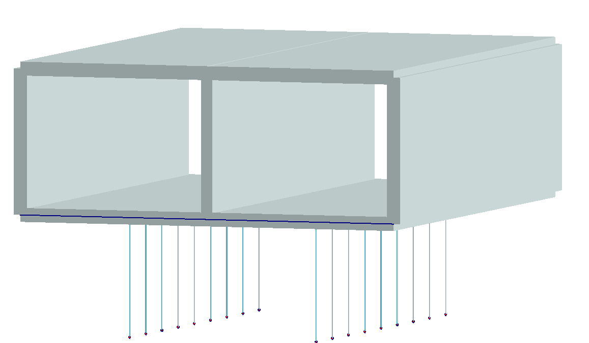

Another couple nights to experiment on the parametric design with FEM-Design and Grasshopper. No problem with geometry and load definitions except couple of small bumps. The load combinations require more than couple nights, so I just move to the GUI if I need. 

<video controls style="max-width:100%"><source src="Screenshot-20230121-1447.mp4" type="video/mp4"></video>
I
