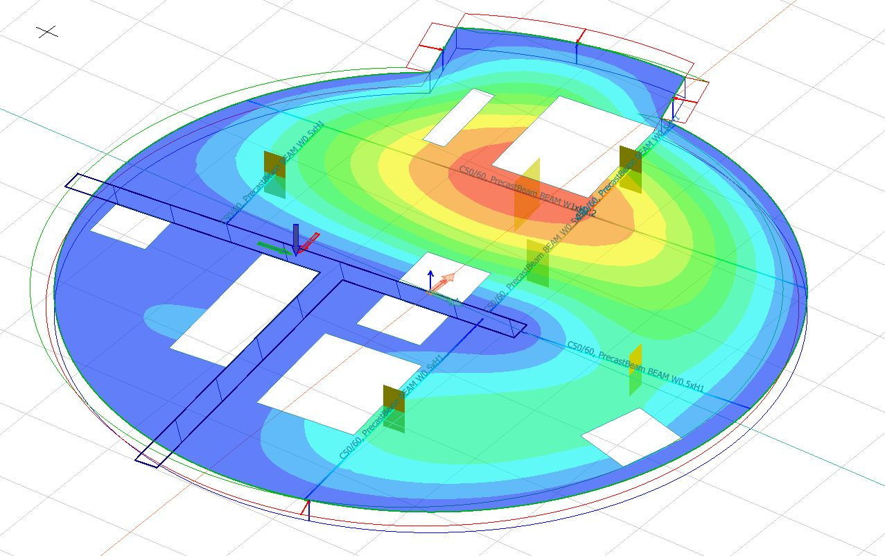
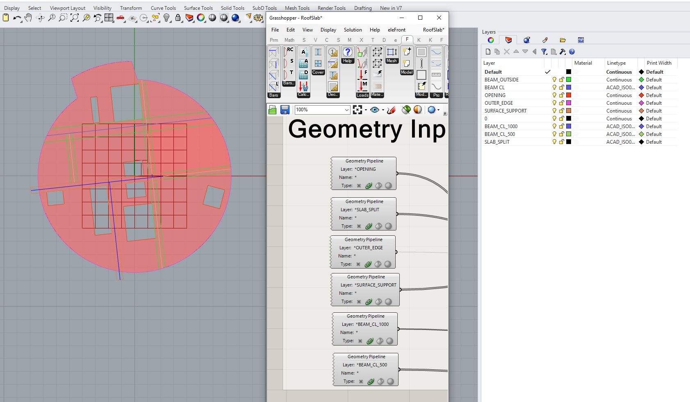
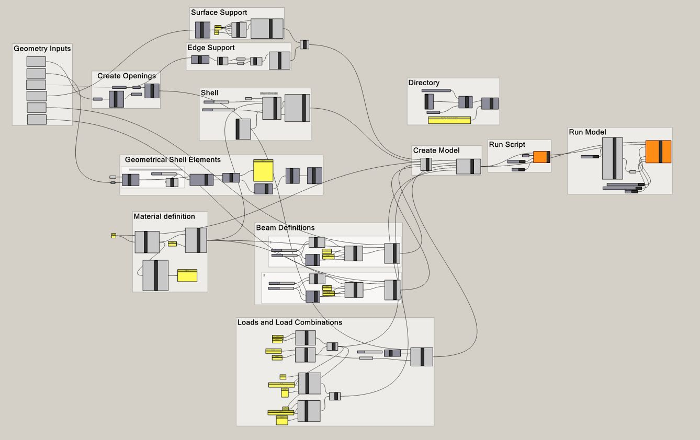

I have been working on [StruSoft](https://www.linkedin.com/company/strusoft/)'s FEM-Design and [Grasshopper](https://www.linkedin.com/feed/hashtag/?keywords=grasshopper&highlightedUpdateUrns=urn%3Ali%3Aactivity%3A6957347171528527877) connection for a trial case of a **precast roof slab for a shaft**. The results were great and even more than I expected! I was OK with some post-processing, but getting the results directly with a one-click from Grasshopper was amazing. It can handle shell connections, supports, load combinations and all I needed for this case. It is still improving a lot every day.

