---
title: "Searching for an Immersed Tunnel from 1900"
date: 2023-09-07T00:00:00+00:00
draft: false
tags: ["Tunnels and Structures"]
---

It started with ITA (International Tunnelling Association) WG 11’s catalogue of immersed tunnels. The third one (and also the fourth) in the list is from Copenhagen. 
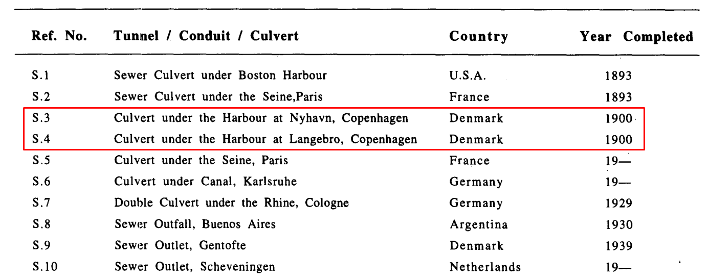
Actually, the culvert is located in the most photographed region of the country - under Nyhavn. In this excellent catalogue prepared by Nestor Rasmussen (DK) and Walter Grantz (USA), the S.3 tunnel has been described as shown below.
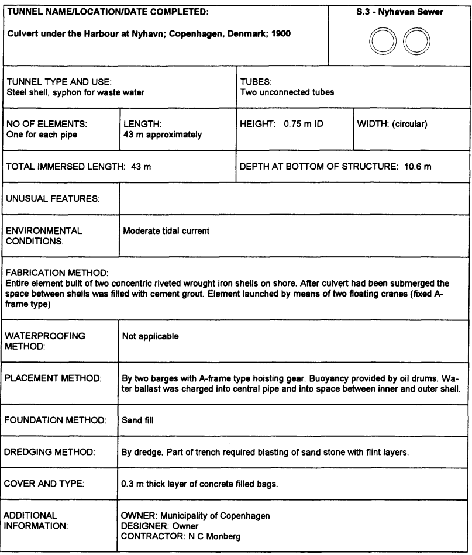
Then, search is started. With the help of people from Reddit, we found the location of the tunnel in the HOFOR database. 
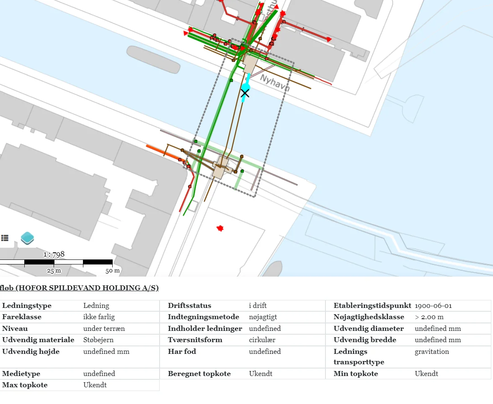
The possible location is under Nyhavn’s connection to the sea - which shown with blue dashed line.
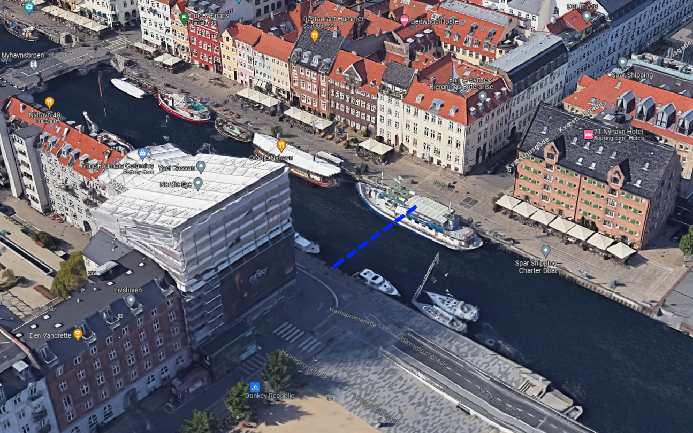
In one of the documents, it says *“Den dykkede ledning i Nyhavn blev nu også lagt. Den gik fra Kvæsthusgade til Havnegade.”* which translates to *“The submerged pipe in Nyhavn was now also laid. It ran from Kvæsthusgade to Havnegade.”*
Afterwards, I contacted the Københavns Museum, and Jakob Ingemann Parby, Senior Researcher and Museum Inspector, has reached out to me to provide more resources. 
In one of the resources online, Københavns Energi A/S’s (previous name of HOFOR) book called *“Fra stinkende rendestene til computerstyrede kloakker*” (in English *“From smelly gutters to computerized sewers”*) had more information on the topic.
This beautiful image shows the lowered steel pipes:
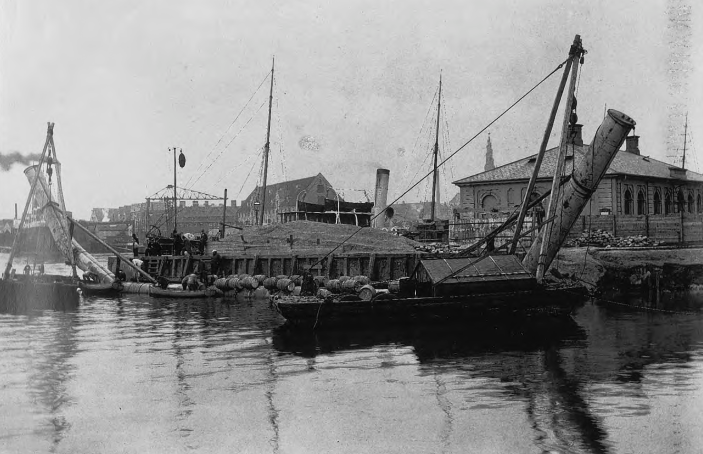
Let’s zoom in a little bit. I think they used barrel as ballast to sink the pipes.
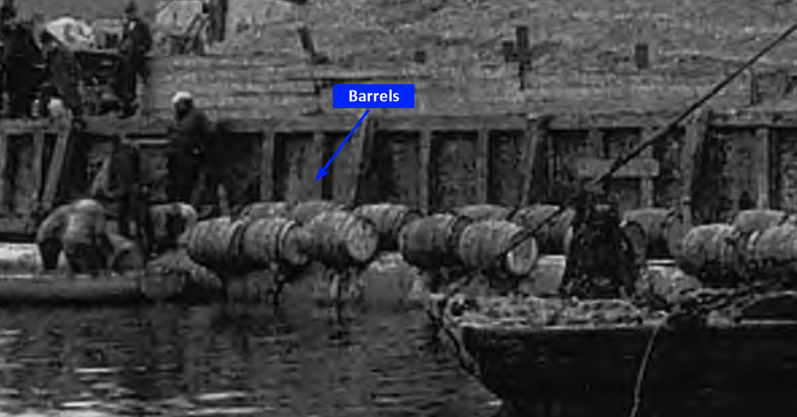
Pipe may look like very flexible, but it’s not actually, the design of the pipe is with bent corners as shown in the image. Actually, we even have a construction drawing.
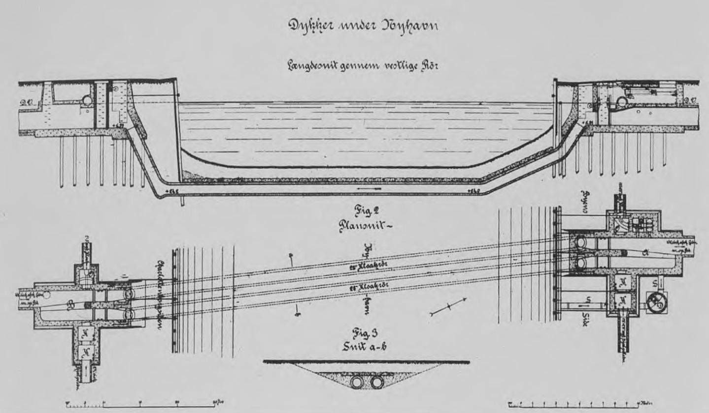
We can see the backfilling and longitudinal profile of the pipe. They had gate valves to periodically flush the pipes that accumulate dirt and sediments.
Another construction stage photo is coming from Københavns Museum archive - Jakob Ingemann Parby. You can see the cranes and same shape:
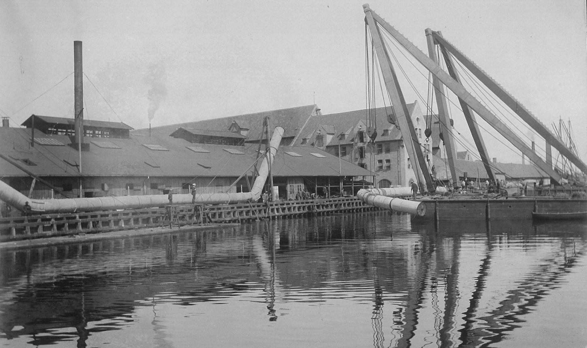
# Also the fourth…
In this search, again in the same book from Københavns Energi A/S, we can see the fourth immersed tunnel in the catalogue: The tunnel under Langebro harbour - which is around 1 km south-west of the Nyhavn
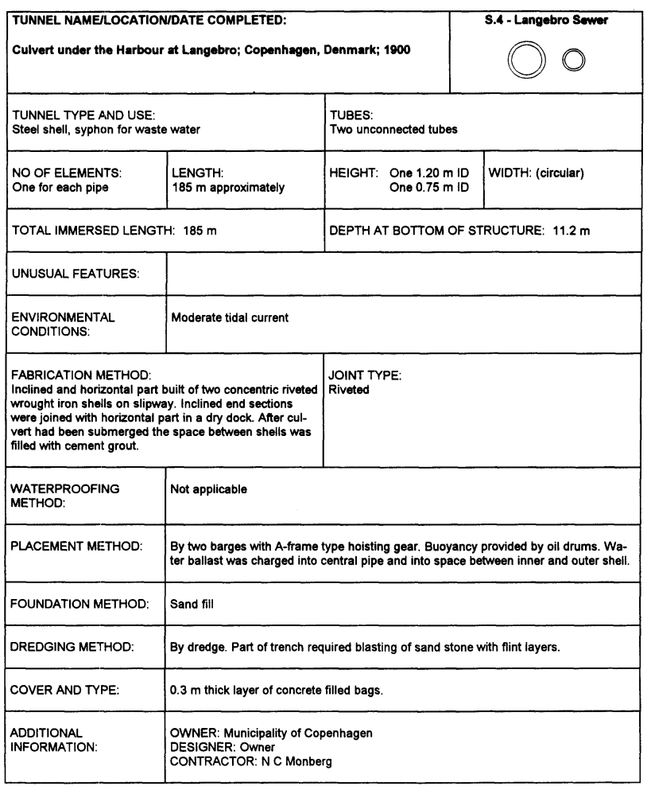
Look at these beatuies in Langebro:
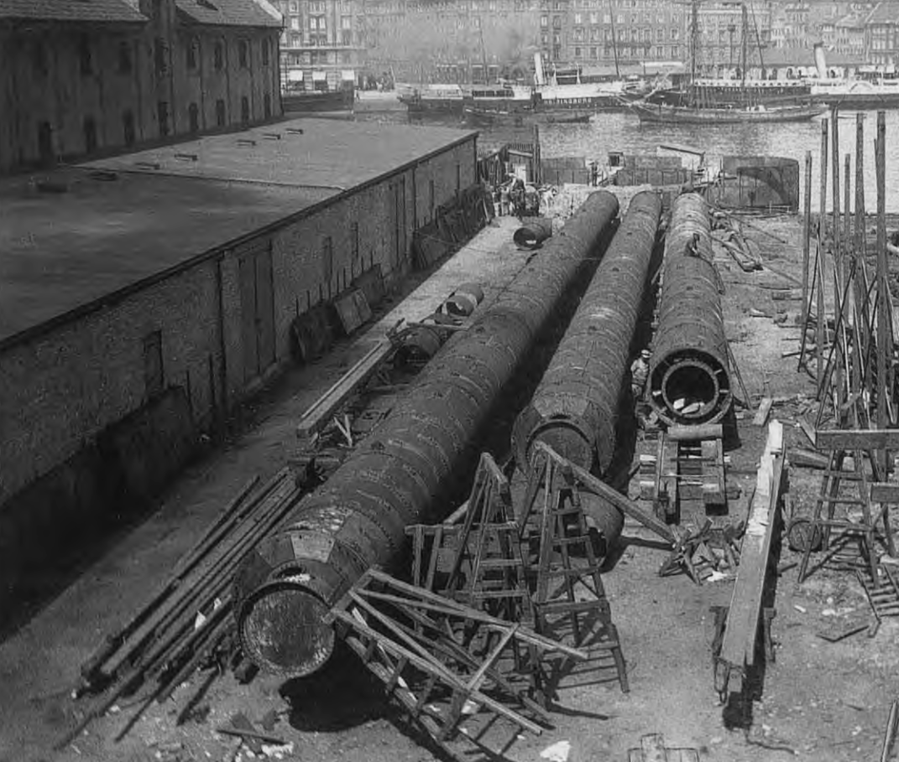
Both of these immersed tunnels have been carried out by double steel shell - with cement grout injected between the shells. The shells can clearly be seen on the tube at the right side on the figure above. Also, after the backfill, they have poured concrete to avoid ship anchor damages. Wow! 
Apparently, Langebro tunnel is relocated during dredging at 1963.
And this is the NC Monberg (1856-1930), the contractor of the tunnels.
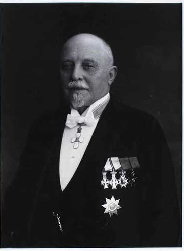
