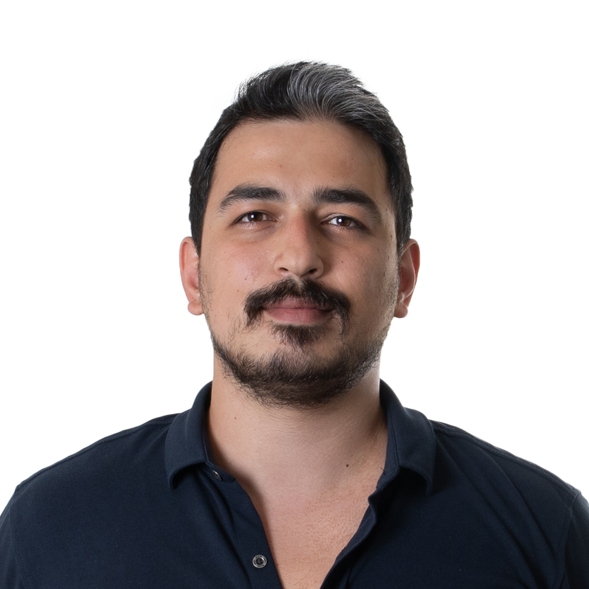

# CV-rev0206

{: width="150" .float-left .aio-ui .aio-window}
**Berk Demir** 

*Underground engineer specialized in tunnels, structural design and geotechnical engineering.*

**E**: bdberkdemir@gmail.com \| **A**: Copenhagen, Denmark

---

# Brief Summary

I started my career as a **geotechnical engineer** and worked on many aspects of geotechnics such as deep excavations, deep foundations, liquefaction remediation and so on. Later, I continued my work on the Istanbul metro as **lead tunnel designer** for both TBM and NATM tunnels. After moving to Denmark, I continued to work on various underground projects with an increasing focus on **structural design**.

---

# Professional Experiences

* **Niras A/S \| Senior Tunnel Engineer** \| 2021 - Cont. \| Copenhagen, Denmark
* **Tekfen Engineering Co. Inc. \| Senior Geotechnical and Tunnel Engineer** \| 2018 - 2021 \| Istanbul, Turkey
* **Destech Consultancy \| Geotechnical Design Engineer** \| 2017-2018 \| Izmir, Turkey & Tanzania
* **Kilci Engineering \| Geotechnical Design Engineer** \| 2015-2017 \| Ankara, Turkey
* **Sonar Drilling \| Technical Office Engineer** \| 2014-2015 \| Ankara Turkey

---

# Academical Background

- Middle East Technical University, Turkey, Geotechnical Engineering Division, Master Study, 2014 – 2019
- Middle East Technical University, Turkey, Civil Engineering, 2009-2014

---

# Technical Publications

Most of the technical publications, as well as various technical articles and showcases are published in the [personal blog](http://bdem.notion.site).

- Recommendations for Pseudo-Static Deformation for Seismic Analyses of Tunnels, Berk Demir & Pinar Akdogan Demir, 2022. [Link](Recommendations%20for%20Pseudo-Static%20Deformation%20for%20%2073d92be08e334a17993cb704f1367a05.md)
- **Master Thesis:** [Performance of Short Anchors Inside the Failure Wedge (2019)](images/CV/Demir_-_Performance_of_Short_Anchors_Inside_the_Failure_Wedge.pdf)
    
- Comparison of Simplified Piled Raft Calculation Methods with Plaxis 3D and Details of Hardening Soil Model
(2019) [in Turkish]: [Link](https://www.researchgate.net/publication/332188093_Basitlestirilmis_Kazikli_Temel_Hesaplama_Yontemlerinin_Plaxis_3D_ile_Karsilastirilmasi_Hardening_Soil_Modelinin_Detaylarinin_Incelenmesi)
    - Hardening Soil part of the publication is published [here](Hardening%20Soil%20Model%200de9cb85d1184d72933f8521c4348376.md).
- P-Y Curves and Turkish Building Earthquake Code Requirements (2 papers), B. Demir, A. S. Peker, S. K. Tomaç,
4th Bridges and Viaducts Symposium, 2019 [In Turkish]: [Link1](https://www.researchgate.net/publication/337941366_P-Y_Egrileri_Ve_TBDY_2018_Gereklilikleri_P-Y_Egrilerinin_Degerlendirilmesi_Bolum_1) & [Link2](https://www.researchgate.net/publication/337941206_P-Y_Egrileri_Ve_TBDY_2018_Gereklilikleri_P-Y_Egrilerinin_Olusturulmasi_Bolum_2)
- Comparison of Construction Methods of Jet Grout Columns with Respect to Field and Laboratory Tests, B. Demir,M. S. Nalçakan, 16. National Conference on Soil Mechanics and Geotechnical Engineering, Erzurum, Turkey, 2016. [In Turkish]
---
# Skills

## Software

| Plaxis 2D & 3D, *high level.* | Python, *high level* |
| Lusas, *high level* | Strusoft FemDesign, *high level* |
| Autodesk Robot, *intermediate level* | Rocscience Settle, Slide, RS2, *high level* |
| Optum G2, *high level* | Grasshopper, *intermediate level* |

**Various Python tools built in Streamlit** for daily design works: 

| Reinforced Concrete Beam Design | Tunnel Analytical Lining Forces |
| Tunnel Deformation Assessment | M&N Interaction Curve |
| Hoek Brown Analysis | Convergence Confinement Method |
| Drawdown due to Tunnel | Steel Strut Capacity Check |
| Tunnel Relaxation Factor | Tunnel Face Stability Calculation |
| 3D Settlement Analysis | Longitudinal Pipe Capacity |
| Steel Fibre Crack Width | Volume Loss Fit for Measurements |

**Language Skills:** Turkish: Mother Tongue \| English: Fluent \| Danish: Intermediate, improving.
---
# Recent Key Projects

## Nordhavnstunnel (2022 to 2023)

**JV:** MT Højgaard & Besix \| **Client:** Vejdirektoratet, Denmark \| **Amount of Hours:** >800 hrs

{: width="40%" .float-right .aio-ui .aio-window}

{: width="40%" .float-right .aio-ui .aio-window}

Nordhavnstunnel is 1.6 km cut and cover, cast-in-situ tunnel located in Copenhagen, Denmark. 

**Typical Responsibilities:**

- **All design works during the tender:** Lusas models of representative sections, reinforcement calculations and quantity take-off for tender, uplift anchor calculations for all segments, settlement calculations and discussions regarding the shear key requirement of tunnels.
- **Design coordination after the tender:** I have acted as design lead for many key decisions regarding the all design issues related to tunnel including structural and fire design of tunnels, relationship to 3rd party, coordination of design works and QA of design reports.

## Valby Cloudburst Tunnel (2021-2023)

**Client:** HOFOR \| **Amount of Hours:** >1300 hrs

{: width="40%" .float-right .aio-ui .aio-window}

Valby Cloudburst Tunnel project is a detailed design project for Hofor (main utility company of Copenhagen.) In scope of this project, 4 shafts with diameters around 15 m and depths reaching 20 m.

**Typical Responsibilities:**

- All tunnel design works: DN3400 / OD4000 pipe jacking design (which includes TBM related studies, pipe and alignment studies)
- Settlement analyses due to tunnelling and excavations
- Technical coordination of structural and geotechnical design of shafts.

## Kransen Culvert Deep Excavation (2021-2022)

**JV:** Acciona & Implenia \| **Client:** Bane Nor, Norway \| **Amount of Hours:** 800 hrs

{: width="40%" .float-right .aio-ui .aio-window}

Design of excavation for Sandbukta-Moss-Såstad (SMS2A) project, Kransen culvert section using diaphragm walls and prestressed struts in a quick clay slope. 

**Typical Responsibilities:**

- Design lead for all temporary works, including design basis and discussions regarding the safety of the area.
- All finite element analyses of the section including detailed temperature studies of structural elements.
*Design activities have been paused due to risks in the area.*

## GFRP Reinforcement in TBM Tunnel Segments (2023)

**Client:** Metroselskabet, Copenhagen \| **Amount of Hours:** 200 hrs

{: width="40%" .float-right .aio-ui .aio-window}

As a part of the innovation study initiative of Metroselskabet, GFRP reinforcement’s feasibility for TBM tunnel segments have been investigated including detailed CO2 comparisons, fire behaviour discussions, durability studies for possible TBM tunnel depths and load scenarios using Lusas.

## Istanbul Metro / Cekmekoy-Sultanbeyli Line (2019-2021)

**JV:** Dogus & Yapi Merkezi & Ozaltin \| **Client:** Istanbul Municipality \| **Amount of Hours:** >2500 hrs

{: width="40%" .float-right .aio-ui .aio-window}

{: width="40%" .float-right .aio-ui .aio-window}

{: width="40%" .float-right .aio-ui .aio-window}

Detailed design of TBM and NATM tunnels issued to 3rd party and client review, as well as the construction details, including detailed 2D and 3D NATM/TBM models and seismic assessment.

**Typical Responsibilities:**

- TBM design: EPB TBM with 6.57 m diameter. Design packages include segment design and EPB pressure estimates for alignment. Moreover, construction details such as thrust frame, thrust ring inside NATM and launching/receiving schemes were successfully delivered for construction.
- NATM design: Design of temporary and permanent lining of NATM tunnels were also in scope of the tunnel design of this metro line. Temporary support design of all NATM tunnels (including very soft soil conditions) was delivered. Coordinated, supported and QAd the structural teams for design deliverables regarding the permanent lining design.
---
# Other Projects

- **Klimatilpasning af det centrale Lyngby \| 2021-2022 \| Lyngby-Taarbæk Forsyning A/S:** Design of 9 pipe jacking tunnel drives (DN1200) and 12 shafts in central Lyngby for climate adaptation project.
- **Canakkale 1915 Bridge \| 2018-2019 \| General Directorate of Highways, Turkey:** Peer review of Canakkale 1915 Bridge design including anchor block foundations, deep foundations in liquefiable areas and technical specifications.
- **Bodrum Highway Tunnels \| 2018-2019 \| General Directorate of Highways, Turkey:** Design of 2-lane NATM highway tunnels in Bodrum / Turkey through mountainous areas.
- **Akyazi-Dokurcun Road \| 2018 \| General Directorate of Highways, Turkey:** Balanced cantilever viaduct foundation and 40 m excavation in weathered rock.
 {: width="40%" .float-right .aio-ui .aio-window}
- ***Dar es Salaam - Morogoro Railway \| 2018 \| Tanzania Railways:*** Geotechnical designer of contractor for design and build project of 205 km. Design of track beds, embankments and various foundations for viaducts, bridges and overpasses.
- **Cargo Building Foundation for Istanbul New Airport \| 2018 \| Turkish Airlines**
- **Excavation Design in Galataport, Istanbul \| 2017 \| Salipazari Port Management**
- ***Grand Canyon Sofia \| 2017 \| Garanti Koza:*** Remediation measures for problematic diaphragm wall panels.
- **Canakkale Children’s Science Museum \| 2017 \| Kale Bodur:** Design of liquefaction remediation measures for highly liquefiable soils near Aegean Sea.
- **Hopa-Borcka Highway Cutting \| 2017 \| YDA**
- **Polatli-Afyon High Speed Train \| 2015-2017 \| YDA:** Design of 88 km stretch with 57 embankments including time dependent Settle 3D models, design of stone columns to decrease consolidation time and jet grout support design and foundation design of over 40 structures including viaducts, underpasses and overpasses.
- **Atakoy Sea Pearl \| 2015-2017 \| Kuzu Group:** Design of retaining systems near Marmara Sea.
- **Dam Landslide (1.5 km x 0.6 km) Stabilization \| 2017 \| Kalehan Energy**
- **Ulus Cultural and Convention Center \| 2016-2017 \| YDA:** Deep excavation up to 22m in changing ground conditions from andesite to very soft clay with high ground water table.
- **Cukurova Regional Airport \| 2016 \| General Directorate of State Airports:** Ground improvement of various buildings.
- **Mavisehir Optimum Mall \| 2016 \| Renaissance Construction:** Designing the deep excavation with diaphragm wall and anchor systems and solving the foundation systems with jet grouts in a very soft and deep clay.
{: width="40%" .float-right .aio-ui .aio-window}
- **Dalaman Airport International Arrivals \| 2016 \| YDA:** Jet grout improvement for very soft clay and liquefiable sands.
- **Turkmenistan Gas to Gasoline (GTG) \| 2015-2016 \| Renaissance-Kawasaki:** To reduce the settlements to the given limits (5-25mm) due to structural needs, performing Plaxis 2D analyses, determining ground improvement methods to be applied.
- **Melen Dam Road Landslide Stabilization \| 2015 \| Ece Tur:** Stabilization of 3 million m³ landslide that occurred in the dam service road with heel fill economically.
- **Buski East Waste Water Treatment Facility \| 2015 \| Kuzu Group:** Ground improvement with jet grouts to prevent liquefaction and excessive settlements.
- **Various other designs** including deep excavations and foundations.
- **Technical Office support b/w 2014 and 2015 to various projects:** Ozdilek Mall, Riyadh Metro Line 3, Balkupu 60000 tons silo foundation piles and various deep excavation projects including inclinometer readings, anchor tests and technical support.